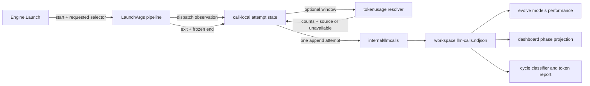

# Model Attempt Telemetry

Model attempt telemetry answers four separate questions without treating an
unknown value as zero:

1. Which CLI invocation did the orchestrator attempt?
2. Which model selector reached that invocation boundary, if it is known?
3. How long did the Bridge dispatch path take?
4. Which input, output, and cache token counts were actually measured?

The canonical ledger is `<workspace>/llm-calls.ndjson`. Its schema, storage,
reader, import operation, and performance aggregation live in
`go/internal/llmcalls`. Bridge supplies lifecycle facts. Token collectors supply
optional usage evidence. CLI and dashboard packages are read-only projections.
There is no second durable performance index.



## Ownership and measurement boundary

One completed, orchestration-owned `Engine.Launch` invocation makes exactly one
ledger append attempt. A nil token resolver, resolver error, driver failure, or
missing token source does not remove the lifecycle record and does not change
the launch result.

The `bridge_dispatch` timer starts immediately before `Engine.Launch` calls the
shared `LaunchArgs` pipeline and stops immediately after that call returns. It
includes argument parsing, validation, preflight, and driver execution. It
excludes:

- workspace creation and prompt-file materialization performed earlier in
  `Engine.Launch`;
- token resolution;
- ledger locking and append time;
- response artifact reading performed after a successful dispatch.

The end timestamp is frozen before token enrichment begins. A slow collector
therefore cannot inflate model latency. Direct calls to public `LaunchArgs` and
errors that return before the shared invocation begins are outside this ledger
boundary. Callers must not describe the ledger as covering those paths.

`phase-timing.json` retains a different scope: it measures an orchestrator phase
and can include retries, validation, report handling, and other work around one
or more Bridge attempts. The two durations are useful together but are not
interchangeable.

## Record schema

Schema version 2 adds explicit lifecycle and provenance fields while retaining
the historical fields used by older readers.

| Field | Meaning |
|---|---|
| `schema_version` | `2` for the canonical lifecycle schema; absent on legacy rows. |
| `call_id` | Opaque process-unique attempt identity used for import deduplication and correlation. |
| `ts` | Compatibility terminal timestamp. |
| `started_at`, `ended_at` | UTC RFC3339Nano bounds for the measured timing scope. |
| `timing_scope` | Currently `bridge_dispatch`. Missing legacy scope is reported as `legacy_unspecified`. |
| `agent`, `phase`, `attempt` | Orchestrator role and retry identity. An unset attempt becomes `1`. |
| `cli` | Driver selected for this attempt. |
| `model` | Historical requested selector retained for compatibility. It is not proof of dispatch. |
| `requested_model` | Selector requested by orchestration, which may be a tier such as `deep`. |
| `dispatched_model` | Concrete selector observed at a launch or REPL-send boundary; omitted when unknown. |
| `dispatch_source` | `argv`, `repl`, `positional`, `cli_default`, `resumed_session`, `not_started`, or `unknown`. |
| `tokens` | Observed input, output, cache-read, and cache-write counts. Interpret with `usage_status`. |
| `source` | Collector evidence such as `transcript`, `events_result`, `scrollback_peak`, or `none`. |
| `usage_status` | `measured`, `partial`, `unavailable`, or `resolver_error`. |
| `duration_ms` | Milliseconds within `timing_scope`; absent means unavailable, while `0` is a measured zero duration. |
| `exit_code` | Terminal Bridge exit when present. |
| `cause_code` | Stable host-authored classification for non-zero exits. Provider prose cannot set it. |
| `tripwire` | Existing uncovered, long-running, successful non-Claude collection warning signal. |
| `fill_pct` | Context-fill percentage, or `-1` when unavailable. |

`first_output_ms` and `first_output_source` remain optional and are not emitted
today. Headless stdout bytes, a changing tmux pane, and a provider's first token
do not identify the same event. Recording one as universal time to first token
would produce a misleading comparison.

## Dispatch identity rules

Dispatch identity is observed by the driver that owns the final invocation:

- Headless drivers observe the selector after log and sandbox preparation and
  immediately before calling the process runner. A runner start failure still
  represents an attempted invocation with that selector.
- A new tmux session observes its selector only after the CLI launch command is
  successfully sent. A failed transport remains `not_started`.
- A `/model ...` seed replaces the launch selector only after that individual
  REPL command is successfully sent.
- A named, already-running session is `resumed_session` with no concrete model
  because generated flags were not sent to it.
- An omitted selector is `cli_default` with no guessed concrete model.
- Codex records the selector after its ChatGPT-account safety clamp. The clamp
  and telemetry share one provider-specific grammar for split and inline
  `-m`/`--model` flags plus `-c`/`--config model=...` overrides. Dedicated
  model flags take precedence over config overrides regardless of argv order.
  Repeated config overrides retain their ordered override semantics, but a
  second surviving dedicated model flag is a provider argument conflict; its
  dispatch identity is `unknown` and the clamp does not invent an effective
  selector. An empty dedicated value is also `unknown`, including before a
  later repetition. This follows Codex's composition of the dedicated CLI model
  above the generic config model in the pinned
  [CLI override](https://github.com/openai/codex/blob/rust-v0.147.0/codex-rs/tui/src/lib.rs#L997-L1011),
  [config resolution](https://github.com/openai/codex/blob/rust-v0.147.0/codex-rs/core/src/config/mod.rs#L3628-L3635),
  and scalar [model option](https://github.com/openai/codex/blob/rust-v0.147.0/codex-rs/utils/cli/src/shared_options.rs).
- Selector evidence is derived from the exact deduplicated launch vector:
  manifest-generated flags form a trusted prefix, while the surviving raw
  profile suffix and direct extras use the conservative parser. Codex config
  syntax is not applied to another provider's `-c` flag. Unknown option arity
  makes the selector `unknown` rather than storing model-looking prompt or
  option text. Ambiguity is sticky across later argument segments.
- The existing ChatGPT-account clamp covers `Realization.LaunchFlags`, including
  profile raw flags. Direct `BridgeRequest.ExtraFlags` are appended later as the
  explicit inner-CLI pass-through. Telemetry observes a verified selector there,
  but the clamp does not certify that operator-supplied override as plan-safe.
- Parsing stops at `--`, and that terminated state also survives the boundary
  between profile flags and direct extras. Model-looking positional text after
  either boundary cannot replace an earlier verified selector.

The record never stores a prompt, response body, environment value, complete
argv vector, transcript content, or workspace file content.

## Storage and import guarantees

All writers use the canonical `llmcalls.Append` or `llmcalls.Import` operation.
They acquire the repository-standard cross-process sidecar flock at
`<ledger>.lock`. Import holds that destination lock across its identity scan and
all appends, so independent salvage processes cannot both admit the same
`call_id`.

Each record is marshaled and appended with one write. The maximum encoded JSON
record is 1 MiB; readers reserve separate delimiter capacity so a record at the
exact writer limit remains readable. If a prior process left a non-newline tail,
the next append inserts a separator. Readers keep valid records, count malformed
or unrelated JSON lines as skipped, and require the minimum historical
invariant `phase != ""`. JSON `null`, empty objects, and unrelated envelopes do
not become zero-valued attempts.

Import preserves the exact valid source bytes. Version 2 rows deduplicate on
`call_id`; legacy rows use a SHA-256 identity of their trimmed JSON line. Running
probe salvage repeatedly is therefore idempotent.

## Performance index

`evolve models performance [--evolve-dir PATH] [--json]` scans canonical ledgers
under `.evolve/runs/cycle-*` and computes an in-memory index. Probe-salvage data
under `.evolve/models-probe` is diagnostic evidence and is not mixed into cycle
performance.

Groups remain comparable by separating these dimensions:

- CLI;
- verified dispatched model;
- requested selector;
- dispatch source;
- token measurement source;
- timing scope;
- outcome (`success`, `failure`, or `unknown`).

Each group reports attempt and outcome counts, latency sample and unavailable
counts, total/minimum/p50/p95/maximum latency, usage coverage, observed token
totals, and amortized measured output throughput. Human output prints missing
latency as `-/-`; a measured zero-duration sample prints `0s/0s` with a non-zero
sample count. JSON output is an envelope containing `attempts`,
`malformed_skipped`, `read_warnings`, and `groups` so degraded input is visible
to automation.

The output rate is:

```text
sum(measured output tokens) / sum(positive bridge_dispatch seconds)
```

Only complete `measured` usage with a positive duration contributes. Partial
scrollback floors, unavailable usage, resolver errors, negative counters, and
non-positive durations never produce a rate. The value includes tool execution,
provider queueing, network time, and response generation, so it is named
amortized output throughput rather than decode speed.

Resolver output is normalized before persistence. A negative token counter
discards the complete usage sample, invalid peak counters discard contributor
detail, and a non-finite or sub-sentinel fill value becomes `-1`. Each repair
emits a contextual warning. This guarantees that durable JSON remains valid and
that corrupt collector values cannot enter totals or throughput calculations.

Input throughput is unavailable because the Bridge has no provider-independent
boundary separating prompt prefill from queue and transport time. Time to first
token is unavailable for the same reason. These fields should be added only
with a new source-specific timing contract and must be grouped by that source.

## Consumers and correlation

The dashboard, token report, cycle classifier, and probe salvage all use the
canonical reader or import operation.

Dashboard phase rows select the latest unused attempt whose start and terminal
timestamps lie within that phase occurrence. Whole-second legacy phase ends
include their final fractional second, but a call with a precise start in the
next repeated phase belongs to the later occurrence. A timestamp-only call in
the overlap is withheld from both occurrences because its owner is unknowable.
Repeated phases with indistinguishable timestamp windows likewise receive no
attempt attribution. One attempt index can be used at most once. When timestamp
evidence cannot be associated safely, the dashboard leaves routing blank.
Ordinal fallback is reserved for wholly legacy, untimestamped data.

The cycle classifier evaluates the latest recorded exit for the phase even when
usage is unavailable. A failed retry can no longer inherit an earlier exit-zero
classification merely because its token resolver failed.

## Diagnostics

Attempt warnings carry `call_id`, quoted CLI and agent identity, and attempt
number. Bridge and command diagnostics share `internal/log.DiagnosticField`,
which bounds each untrusted field to 512 Unicode code points and emits it with
ASCII escapes in one quoted field. Newlines, terminal controls, invalid UTF-8,
and bidi formatting marks cannot inject another log line. Append, resolver,
ledger-read, and probe-salvage failures name the failed operation and retain
their bounded paths or detail. Append and resolver failures stay fail-open for
the model launch while remaining attributable to one attempt.

For a failed attempt, inspect in this order:

1. `cause_code` and `exit_code` for the stable host classification;
2. `dispatch_source` and `dispatched_model` to see whether a selector reached a
   process, a new tmux session, or a REPL command;
3. `usage_status` and `source` before interpreting zero token fields;
4. `started_at`, `ended_at`, `duration_ms`, and `timing_scope` for latency;
5. the phase launch-error file and the contextual Bridge diagnostic for bounded
   human evidence.

This order keeps control-plane facts separate from untrusted provider text and
prevents missing measurements from looking successful or free.
