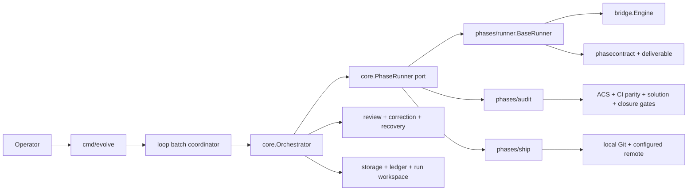

# Phase architecture

This document describes the current Go runtime. Historical shell-dispatch details belong in [migration-from-bash.md](../migration-from-bash.md); they are not a fallback execution path.

The source of truth is split by responsibility:

- `docs/architecture/phase-registry.json` declares built-in phases, the legal-successor graph, the mandatory spine, goal recipes, and deliverable-kind contracts.
- `go/internal/core` enforces cycle state, transition safety, review, recovery, and lifecycle invariants.
- `go/internal/phases/runner` executes LLM-backed phases through a shared runner.
- `go/internal/bridge` owns provider transport and tmux session mechanics.
- `go/internal/phases/audit` applies independent host gates to an audit report.
- `go/internal/phases/ship` performs the native Git integration transaction.
- `.evolve/policy.json` selects optional behavior and per-phase routing within the compiled safety floor.

## Runtime calls and composition

The arrows below are runtime calls, not Go imports. `cmd/evolve` is the composition root: it may import concrete phase packages, while Core depends on ports and must not import those implementations.



The Go binary is the sole runtime entry point. `evolve loop` drives one or more cycles; `evolve cycle run` drives one cycle; `evolve subagent run` uses the same native bridge and profile restrictions for a direct phase invocation.

## Batch lifecycle

The `go/cmd/evolve/cmd_loop*.go` files own the outer batch. Their responsibilities are ordered because later steps assume earlier recovery and safety checks have completed:

1. Classify the checkout plane and handle `--dry-run`.
2. Create a signal-cancellable batch context.
3. Select or derive the per-run tmux socket and register its terminal disposition.
4. Reap orphan sessions from crashed prior runs without touching a live owner.
5. Load the orchestrator and workflow configuration.
6. Prune expired failure/carryover state and apply an explicit operator reset.
7. Handle `--resume`, which runs one resumed cycle and exits.
8. Refresh a stale binary, perform boot recovery, reject an unfinished fresh cycle, and run readiness preflight.
9. Execute sequential cycles, fleet waves, or a rolling pool according to policy.
10. Apply quota, system-failure, repeated-cycle, goal-stall, non-progress, and cycle-budget stop rules.
11. Reap completed-cycle resources, sweep finalized worktrees, and emit the batch result.

The implementation keeps those responsibilities in one package while separating their owners:

| Component | Responsibility |
|---|---|
| `cmd_loop.go` | CLI parsing and composition entry point |
| `cmd_loop_runtime.go` | signal context and process-owned tmux socket lifetime |
| `cmd_loop_maintenance.go` | bounded failure and carryover state maintenance |
| `cmd_loop_prebatch.go` | fresh-run recovery, unfinished-cycle guard, preflight, and start sweep |
| `cmd_loop_resume.go` | single resumed-cycle protocol and exit mapping |
| `cmd_loop_batch.go` | batch coordinator and terminal result mapping |
| `cmd_loop_window.go` | boundary refresh plus fleet/pool dispatch |
| `cmd_loop_sequential*.go` | sequential dispatch, observation, ledger verification, and breaker outcomes |

The coordinator owns the mutable cross-iteration state. Extracted stages return a typed `batchDecision`; they do not terminate the process or introduce a second result object.

An interrupted batch is resumable. It may intentionally retain its worktree and checkpoint. A clean terminal batch destroys only resources it owns; inherited/operator tmux sockets and named REPL sessions have separate preservation rules.

## Cycle state machine

`go/internal/core/statemachine.go` supplies the compiled floor. `phase-registry.json` can add routing data and user phases, but `ValidateSafetyInvariants` rejects a configuration that creates a path to Ship without the mandatory evidence spine.

The built-in spine is:

```text
start → [intent] → scout → [triage] → [tdd] → [build-planner] → build → audit → ship → end
```

Square brackets indicate policy- or content-selected phases. This compact line is not the complete transition graph:

- Scout and Triage may end early only when the deterministic early-exit floor says no shippable work exists. An explicit `triage-decision.json` with an empty array `top_n: []` supplies the commitment evidence; `null`, a missing field, a malformed decision, or any other shape is unknown and cannot authorize this path.
- Audit FAIL may re-enter TDD or Build for a bounded repair, or route to Retrospective.
- Ship failures may route through Debugger and retry stages allowed by the legal-successor graph.
- Retrospective and post-Ship observer phases can be inserted by the router while the mandatory spine remains satisfied.

Intent is optional by default. It runs when the workflow phase enable or cycle context requires it. `CycleState.IntentRequired` persists that choice so resume and fleet execution cannot silently choose a different start edge.

### Fresh execution

`Orchestrator.RunCycle` allocates the cycle/run workspace and constructs a `cycleRun`. The `cycleRun` files separate phase selection, dispatch, review, recording/branching, remediation, and closeout while sharing one cycle state. Dynamic routing may advise a successor, but the state-machine and mandatory-spine floors clamp the result before execution.

At each iteration, Core first checks whether an enforce-stage parallel-evaluation batch begins at the selected phase. When it does, Core dispatches that batch and skips the sequential path. Otherwise the fresh sequential path:

1. persists the phase start and dispatch context;
2. dispatches through retry/fallback policy;
3. recovers escaped worktree writes and normalizes host-owned output before review;
4. runs deliverable review, the bounded correction ladder, and the final tree-integrity guard;
5. performs remediation where the fresh lifecycle permits it;
6. records the phase outcome, ledger evidence, and next branch.

Static and dynamic routing both honor Triage's authorization boundary at every rollout stage. A failed Triage contract stops before TDD and remains FAIL, regardless of any decision sidecar. A PASS or WARN Triage with an explicit empty array stops as planned no-work. The host records that disposition in `CycleResult.TerminationReason`, and closeout reclassifies it only when Triage is the terminal phase and no implementation phase or prior floor ran. This separates artifact evidence from host authorization and prevents an empty or forged sidecar from erasing a genuine failure.

### Resume execution

`LoadResumeState` discovers either the singleton checkpoint or a fleet lane's per-run checkpoint. `ActivateResumeStatePath` keeps subsequent writes bound to the file that was discovered. `RunCycleFromPhase` restores the run identity, lease, context, transition plan, audit round, and cycle state before continuing.

Resume shares many invariants with fresh execution but is not currently identical. It deliberately uses deterministic history branching, excludes the live debugger override, and supports legacy checkpoints whose explanation contract was inactive. Any unification must classify these differences before moving code; a behavior-preserving refactor cannot assume byte parity between fresh and resumed runs.

The resume implementation is divided into `resume_bootstrap.go`, `resume_cursor.go`, and `resume_execution.go`. Fresh correction and post-review work live in `cyclerun_correction.go` and `cyclerun_postreview.go`. Both paths call `phase_completion.go` for the durable completion boundary: completed-phase state, final-verdict persistence, judgment learning, authoritative-floor failure recording, and phase timing. Dispatch selection, parallel evaluation, debugger routing, remediation, and legacy explanation handling remain path-specific because their contracts differ. A future full shared phase engine requires separate behavioral design and differential tests for those differences.

## Phase catalog

The registry contains mandatory spine phases and optional phases selected by policy, goal recipes, or content signals.

| Phase | Default role | Kind | Required in every shippable code cycle | Primary output |
|---|---|---|---|---|
| Intent | structure goal and constraints | LLM | No | `intent.md` |
| Scout | discover and specify work | LLM | Yes | `scout-report.md` (the router reads `handoff-scout.json` only as an optional signal file no scout has produced in recent cycles) |
| Triage | choose and bind task scope | LLM | Policy default on | `triage-report.md`, `triage-decision.json` (agent-owed, ADR-0100); effect `inbox-claim` (verified, ADR-0100 slice 2) |
| Spec Verify | check specification claims | LLM | No | `spec-verify-report.md` |
| Architecture Design | design large/cross-cutting work | LLM | Content selected | `architecture-design.md` |
| Plan Review | challenge a plan before implementation | LLM | No | `plan-review-report.md` |
| TDD | materialize executable contracts | LLM | Conditional | `test-report.md` |
| Build Planner | split a large implementation | LLM | Default off | `build-plan.md` |
| Build | produce the scoped deliverable | LLM | Yes | `build-report.md` (the LLM-emitted `handoff-build.json` has been extinct since ~cycle 215; `changedpkgs.FromGit` derives the change set) |
| Doc Sync | update affected documentation | LLM | No | `doc-sync-report.md` |
| Tester | independent test pass | LLM | Content selected | `tester-report.md` |
| Audit | adversarial review plus host gates | LLM + native gates | Yes | `audit-report.md`, `acs-verdict.json` |
| Ship | integrate the audited tree | Native Go | Yes | Git commit/push plus Ship binding |
| Secret/flake scans | deterministic specialist checks | Native Go | Recipe selected | phase-specific report |
| Retrospective | extract failure/success lessons | LLM | Routed | `retrospective-report.md` |
| Memo | compact carryover context | LLM | Routed | `memo.md`, `carryover-todos.json` |

The registry may contain additional optional or user-defined phases. Their presence does not make them mandatory. The router proposes a plan; Core validates the plan against legal successors, phase availability, mandatory anchors, phase contracts, and the Ship floor. Built-in runtime contracts in `go/internal/phasecontract` are authoritative for artifact validation. The registry's TDD output is pinned to the same `test-report.md` name so planning documentation and runtime polling do not drift.

## Shared phase runner

LLM-backed phases use `go/internal/phases/runner.BaseRunner`. Phase packages provide `Hooks` for names, prompt composition, artifact filename, model default, and classification. Small optional interfaces add only capabilities a phase uses, such as an inline prompt or secondary artifacts.

The runner performs one ordered execution pipeline:

1. clear request-derived trust flags and evaluate an optional skip;
2. load the persona, body, profile, and deliverable contract;
3. resolve policy pins, CLI/model tiers, capability and health ordering, and universal fallback;
4. create one worktree fence around the entire fallback chain;
5. dispatch candidates through `llmroute.DispatchTiered` with attempt-local overlays;
6. restore the fence before any reconciliation or classification;
7. reconcile a valid deliverable after an infrastructure teardown without trusting a stale artifact;
8. classify verified artifact bytes once, apply deterministic floors, and write the cleaned output companion.

`preparation.go`, `routing.go`, `dispatch.go`, `reconciliation.go`, and `classification.go` implement these stages. `BaseRunner.Run` remains the facade. One execution owns the worktree fence across the complete fallback chain, so a candidate transition cannot expose unguarded workspace state to reconciliation.

When verification resolves the dispatched contracted artifact, its verified bytes are the verdict source. The existing verifier-error path keeps pane classification because contract well-formedness is then undetermined; explicit pathless or different-artifact contracts also retain their documented fallback. Bridge success without a valid mandatory artifact is a phase failure when verification completed; a valid fresh artifact may rescue only the explicitly supported infrastructure-teardown path.

## Provider bridge and tmux REPL

`go/internal/bridge.Engine` selects a driver from the configured CLI manifest. Native non-interactive and tmux REPL drivers return a common `BridgeResponse` with exit identity, artifact/log paths, model, token observations, and cost observations when the provider exposes them.

The shared tmux REPL path has five conceptual stages:

1. **Session disposition:** acquire provider admission, create or attach the run-scoped session, register ownership, and resolve pane identity.
2. **Boot:** handle known interactive boot prompts until the manifest's readiness marker appears or the boot deadline expires.
3. **Delivery:** capture the artifact baseline, paste the prompt with the provider-specific transport, and verify submission.
4. **Wait:** poll completion evidence, pane liveness, quota/fatal/transient signatures, the live channel, and bounded review/nudge policy.
5. **Capture/disposition:** perform the cancellation-detached final poll, capture raw and clean scrollback, map the terminal exit, release admission, and destroy or preserve the session according to its ownership.

Those stages are implemented in `driver_tmux_prepare.go`, `driver_tmux_boot.go`, `driver_tmux_dispatch.go`, `driver_tmux_wait.go`, and `driver_tmux_channel.go`, with `driver_tmux_repl.go` retaining the ordered facade and final capture/disposition. The live-injection cursor establishes its EOF cutover before live-channel files are opened, so an envelope arriving during channel initialization remains observable.

The completion wait remains an effectful state machine rather than a pure reducer. Its decisions depend on ordered pane captures, inbox drains, persistence gates, liveness aggregation, reviewer callbacks, prompt injection, clocks, and cancellation-detached final polling. Converting it to a pure transition table would require a new event model and could change fixture consumption and timing. The current boundary isolates the state machine for focused follow-up without claiming that design change as part of this behavior-preserving extraction.

Artifact completion, provider exhaustion, a dead/fatal pane, cancellation, transient upstream failure, and timeout are distinct terminal outcomes. Named sessions intentionally survive a launch so an allowed caller can resume them; ephemeral sessions are destroyed. Cleanup uses a detached bounded context because the request context is often already cancelled on the path that most needs cleanup.

## Review, correction, and tree integrity

Core reviews every non-skipped deliverable before recording success — on both loops, and for the remediation re-run of a gate phase (ADR-0100 closed the two paths that bypassed review). The contract gate judges the primary artifact's shape and, since ADR-0100, every **agent-owed** secondary the registry declares (`outputs.agent_owed`: exists, non-empty, parses if JSON/NDJSON); harness-produced secondaries (`outputs.harness_produced`, e.g. `acs-verdict.json`) are never demanded of an agent. Since slice 2 it also judges every declared **effect** (`phases[].effects`): triage's `inbox-claim` is satisfied only when each committed inbox item sits under this cycle's `processing/cycle-N/` (`missing_effect` otherwise; `unbound_effect` for a declared name with no check). Ordering is load-bearing:

```text
recover escaped writes → host normalization → review → optional correction → recover/normalize again → re-review
```

A correction uses `interaction.NextCorrection` to choose a bounded rung: salvage, live fix when supported, or redispatch. A redispatch may use a different CLI family only for the configured repeated-identical contract block. Temporary correction directives and routing overrides are restored before leaving the ladder.

Only after approval does Core refresh explanation evidence when required, latch Ship success, and run the final tree-diff guard. Registered minted paths and sanctioned generated binary churn have explicit handling; an unregistered source leak aborts rather than being converted to a warning.

## Audit evidence lifecycle

Audit combines agent judgment with host-owned evidence. Host gates outrank narrative prose, but their failure dispositions differ. The lifecycle is ordered:

1. quarantine untrusted probes before host execution;
2. invalidate agent-authored predicate evidence, then retire any prior candidate;
3. regenerate and read host predicate evidence;
4. execute supporting repository gates and reconcile continuation and closure evidence;
5. write verdict-conflict diagnostics, apply strict-audit promotion, then emit defect-ledger records;
6. invoke the late evidence-seal callback, which may still force the returned verdict to FAIL;
7. record shadow chain reasoning.

`classification.go` parses the narrative disposition and prepares evidence, `gates.go` executes repository and CI gates, and `disposition.go` reconciles continuation/closure evidence and applies the final ordered disposition. `hooks.Classify` is the facade. Diagnostic severity and blocking authority remain separate values; a warning label alone never determines whether a gate blocks.

Host predicate execution errors fail closed. Some unavailable local checks, including the documented gofmt and solution-check paths, emit a warning without changing the verdict. Code must represent this blocking disposition separately from diagnostic severity; the word `WARN` alone does not define authority.

## Ship transaction

Ship is a native phase. `atomicShip` selects direct versus worktree integration. Each path owns its own integrator lock; the selector does not.

The worktree path preserves this order:

1. validate worktree identity, colliders, and manifest state;
2. normalize sanctioned binary churn and consume sanctioned inbox changes;
3. stage the explicit cycle paths;
4. verify the staged tree against the Audit binding, allowing only the narrow documented consumption-drift exception;
5. create or identify the candidate commit;
6. integrate it or return the typed fleet-rebase requirement;
7. push with the existing fetch/fast-forward retry policy;
8. verify local `HEAD^{tree}` after push;
9. write the Ship binding on its existing best-effort basis.

`worktree_ship.go` represents this path as the concrete `worktreeShip` transaction and typed change state. `worktree_integrity.go` owns the pre-commit and post-push tree checks. The transaction remains unexported and uses the existing `ShipError` taxonomy rather than adding a second error hierarchy.

Before creating a new audit-bound worktree commit, Ship verifies its staged tree. An audit-binding mismatch on that path cannot create a commit. An already committed worktree that is ahead of main follows its existing integration path. Ship errors retain typed stages/classes so the orchestrator can distinguish a task failure, expected fleet rebase, configuration defect, transient infrastructure failure, and integrity failure.

## State, evidence, and ownership

Each cycle has a run workspace under `.evolve/runs/` and normally a per-cycle Git worktree. The cycle state records the active phase, run ID, worktree/base identity, completed phases, transition plan, retry/audit state, and pause information. The ledger binds phase evidence to the run and tree.

The following ownership dispositions are intentionally different:

| Resource | Normal terminal disposition | Interrupted/resumable disposition |
|---|---|---|
| Ephemeral tmux session | destroy | destroy after bounded final capture |
| Named tmux session | preserve when caller requested reuse | preserve |
| Provider admission slot | always release | always release |
| Finalized cycle worktree | reap after Ship/closeout | retain |
| Run lease | stop heartbeat; retain the lease record | stop heartbeat and leave the record; resume reestablishes ownership |
| Per-run socket | destroy when its name equals `DeriveRunSocket(current PID)` | same rule, including a value retained by a chained batch or same-PID re-exec; preserve operator/other-PID sockets |

Fleet lanes use run-scoped state and worktrees. Wave boundaries refresh from the integration head; divergence halts rather than merging in the dispatcher. Git integration remains serialized by the Ship lock even when phase work runs concurrently.

The sequential loop verifier recognizes the same planned no-work path only when the returned result carries the host-owned Triage no-work reason, ends at Triage, records no implementation phase, and the decision artifact still parses as an explicit empty array. It then requires successful Scout and Triage ledger entries, plus Intent when the cycle required it. It does not require Builder, Auditor, or Memo for that shortened chain. The ordinary verification floor remains Scout, Builder, and Auditor, with its existing optional Intent and PASS-Memo requirements. This keeps an artifact alone from weakening the ledger floor.

## Configuration resolution timing

Configuration is not uniformly immutable. Preserve each setting's current lifetime:

- Routing registry and most workflow/retry settings are resolved into the orchestrator or cycle snapshot.
- Per-phase policy pins and model routing are resolved for the phase/attempt scope.
- `policy.StrictAuditFor` deliberately reloads project policy at its call site.
- Cycle context and environment maps carry state across phases and are intentionally mutable at defined Core boundaries.
- Provider token and cost fields are observations. Cost can be absent or cost-blind and is not a universal enforcement budget.

Cycle-count limits, quota/capacity controls, and observed token/cost telemetry are separate contracts. Documentation and validation must not present display-only cost accumulation as a hard budget gate.

The `internal/policy` package keeps `Policy`, `Load`, JSON fields, defaults, and environment precedence as its public facade. Its declarations are grouped by domain in `core.go`, `dispatch.go`, `workflow.go`, `fleet.go`, `routing_gates.go`, `budgets_recovery.go`, `merge_catalog.go`, and `acs_paths.go`. This is a same-package source split; it adds no policy layer or interface.

## Verification boundaries

Unit tests use real package logic and fake only process boundaries such as tmux, Git commands, clocks, and provider execution. Key integration tiers are:

- fake-tmux state and failure matrices, then the dedicated real-tmux fixture;
- fake command execution, then real Git repositories under `t.TempDir`;
- phase-runner contract tests across concrete phase packages;
- fresh/resume lifecycle scenarios in Core;
- Audit gate-precedence and Ship staged-tree-binding tests;
- package race tests for session, fence, lease, and shared-state ownership;
- repository-wide `go vet`, Go tests, and the native commit gate.

Live model calls are end-to-end validation, not unit-test dependencies. A completed live run is useful only when its artifacts share one run/tree identity, its material change passes the normal gates, its telemetry is honest about unavailable fields, and every resource reaches its documented disposition.

## Reading order

1. [AGENTS.md](../../AGENTS.md) for operator and contribution invariants.
2. `docs/architecture/phase-registry.json` for the declarative catalog and transition graph.
3. `go/internal/core/statemachine.go` and `safety_invariants.go` for the compiled floor.
4. `go/internal/core/cyclerun*.go`, `resume*.go`, and `phase_completion.go` for lifecycle execution.
5. `go/internal/phases/runner/runner.go` plus its preparation/routing/dispatch/reconciliation/classification files for shared LLM phase execution.
6. `go/internal/bridge/engine.go` and `driver_tmux_*.go` for provider transport.
7. `go/internal/phases/audit/{audit,classification,gates,disposition}.go` and `go/internal/phases/ship/{gitops,worktree_ship,worktree_integrity}.go` for the final trust boundaries.
8. [migration-from-bash.md](../migration-from-bash.md) only when investigating historical behavior.
