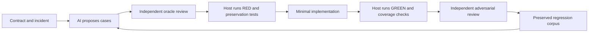

# Test architecture and refactoring design

Status: **design reviewed and merged; implementation tracked separately**. Review date: 2026-09-14. Baseline source: `80b348e6943b08b3bfc4e2d30f06f42db69c1db9` (remote main, PR #601). The original documentation-first proposal merged in PR #602 before code changes. The [integration record](../reports/test-refactoring-integration-2026-09-14.md) distinguishes implemented slices, validation receipts and remaining work. Findings and inventories below describe the pinned baseline unless stated otherwise.

The objective is to make tests easier to understand and maintain while preserving every existing behavior contract and measured coverage. Consolidation follows verification of the harness itself. Strict TDD, clean code, and restrained use of design patterns govern every implementation slice.

## Evidence and scope

The [review dossier](../research/testing-review-2026-09-14/README.md) contains the complete static inventory, detailed test and harness reviews, online research, CI audit, and validation evidence. Its [case catalog](../research/testing-review-2026-09-14/case-catalog.md) translates findings into test contracts.

| Baseline | Result |
|---|---|
| Tracked first-party Go test files, both modules | 2,902 across 700 package directories |
| Actual AST `Test` declarations | 14,496: 14,402 in `go/`, 94 in `landing/` |
| Other entry points | 11 `TestMain`, 8 benchmarks, 2 fuzz targets |
| Identical formatted test-body groups | 59 candidates; **not** 59 proven redundant behaviors |
| Local validation | 13 selected Go packages and all 6 landing packages passed with `-race -count=1`; 509 passing test/subtest events, 423 top-level tests, no skips |
| Latest remote main CI | Go Linux/macOS and general CI passed at the reviewed SHA; details and links in [CI audit](../research/testing-review-2026-09-14/ci-review.md) |

The inventory includes all tracked test files and entry points, regardless of build tags. Assertion-level review is a risk-based sample, concentrated on harnesses, gates, repeated tests, concurrency, and recent decomposition work. It is not an assertion-by-assertion audit of 14,496 functions. Static subtest labels are hints: 770 functions contain dynamically named `Run` calls. Complete executed case identities must come from `go test -json`, not name counting. No finite catalog guarantees all possible edge cases.

The workspace's `console` and `runtime` directories are separate worktrees, not duplicated product modules. The design branch is isolated under `dev/` and based on freshly fetched remote main; reviewed `go/` and `.github/` content agrees with the active runtime tree. Live runtime state and unrelated user changes remain untouched.

## Findings that determine the order of work

| Priority | Issue | Why the existing net missed it | Design response |
|---|---|---|---|
| P0 | `make cover-strict` and `make apicover-enforce` can exit zero after a failing test | Shell pipelines/command chains retain a later successful status. Both were reproduced with real Go and tiny temporary modules; see [CI audit](../research/testing-review-2026-09-14/ci-review.md) | Fix exit propagation under RED meta-tests before treating these gates as preservation evidence |
| P1 | Repeated clean-code scanners miss nesting under `else` | `go/internal/config/limits_test.go:70` descends only through `IfStmt.Body`; the local reproduction passes a six-deep else branch against a limit of four | Test the scanner with good/bad source fixtures, fix traversal, then share it while keeping all 15 package enrollments |
| P1 | Shared fakes can misrepresent real behavior | `go/test/fixtures/fakes.go:59` shallow-copies state; `:254` ignores artifact filesystem errors. Current fixture tests mainly exercise successful roundtrips | Establish fake/real behavioral conformance before migrating more callers |
| P1 | TDD phase completion is not execution proof | `go/internal/phases/tdd/tdd.go:95` checks report structure; `go/internal/phasecontract/contract_test.go:38` intentionally accepts headings without output | Keep report compatibility in a refactor; separately add host-owned fail-to-pass evidence for a stricter execution contract |
| P1 | Reachable legacy simulator does not validate the current installed runtime | `go/cmd/evolve/cmd_cycle_simulator.go:41` selects defaults that call removed shell scripts; tests supply scripts or expect failure | Add a current-installation CLI regression; reuse native composition, with explicit simulation limits |
| P1 | CI/release selection and coverage claims diverge | Release omits eight package selections covered by CI; landing tests have no test job; ordinary 85% coverage is advisory | Make selection explicit, close missing lanes under tests, preserve strict/API gates and compare exact selected/executed sets |
| P2 | Live failure classification may quarantine real contract failures | Broad words in merged model/tool output match transient markers (`go/cmd/evolve/e2e_live_harness_test.go:80`) | Offline adversarial classifier/retry tests; distinguish structured provider failures from task text |

These are separate defect fixes or policy improvements, not permission to change their existing logic during test cleanup. Full findings, confidence levels, and additional candidates are retained in the dossier; no lower-priority findings were silently discarded.

## Retain the existing two-axis organization

Keep [go/docs/testing.md](../../go/docs/testing.md)'s useful separation of cost from granularity. Do not move all tests into a central directory or add a new unit build tag. Co-location preserves discoverability, access rules, and package-level failure context.

| Test responsibility | Home and selection | Contract |
|---|---|---|
| Pure rules, parsers, state transitions | Co-located `*_test.go`, default selection | Input/output values and invariants; table-driven boundaries |
| Exported package behavior | Co-located external-package tests where practical | Public result and error contracts, including API naming requirements |
| Shared test primitives | Existing `go/test/fixtures` | Workspace, clock, runner, recording fakes; test these primitives directly |
| Composed adapter behavior | Existing `go/test/component` | Real temp filesystem and collaborators; no live model |
| Process, git, tmux, OS containment | Existing co-located integration tests and `go/test/integration`, integration tag | Real boundary behavior with controlled fake CLI and positive controls |
| CLI orchestration | Existing `cmd/evolve` e2e files and `go/test/e2e`; `e2e evolve_test_phases` | Real binary, exit status, artifacts and state; exact optional skips |
| Durable acceptance regressions | Existing `go/acs/regression/...`, `acs` tag | Artifact-independent regressions, explicit exceptions for runtime-dependent cases |
| Cycle acceptance and red-team proofs | Existing cycle ACS/redteam homes | Preserve identity, provenance, selection and trusted verdict binding |
| Landing module | Existing `landing` packages | Independent module tests; must be enrolled separately in CI |
| Live provider evaluation | Existing opt-in live tests and manual spike | Capability/drift signal; report unavailable/inconclusive trials separately |

Build tags are additive, not mutually exclusive lanes. `integration` also compiles untagged tests. Retiering requires an old/new selection comparison on every supported OS; moving a file behind a tag without adding an execution lane loses coverage even if the remaining suite is green. Keep test helpers available in every build configuration that imports them.

## Clean-code and pattern decisions

| Need | Smallest suitable pattern | Constraint |
|---|---|---|
| Inputs vary; behavior stays the same | Named Go table cases and `t.Run` | Preserve every input and observable assertion; avoid a flag-filled universal case type |
| Repeated workspace setup | Existing Workspace builder | Each test owns cleanup; defaults remain obvious; no shared mutable fixture singleton |
| External time/process/network | Existing injected function or consumer-owned port plus adapter | Fake the boundary, not domain logic. Use real temp files unless fault injection is necessary |
| Multiple real drivers | Existing Strategy interface with shared conformance runner | Keep driver-specific capabilities/negative cases; do not invent interfaces only for mocks |
| Repeated structure checker | Small dependency-light helper, after search and RED meta-tests | Preserve package scope/thresholds at every enrollment; no dependency back into core |
| Repeated regression artifacts | Package-local `testdata`, existing parsers, a small typed table | Preserve current formats; do not introduce a general testing DSL or duplicate runner |
| Truly composable policy predicates | Existing Specification-style rule composition | Use only where rules already compose; plain functions suffice elsewhere |

`go/test/fixtures` imports `internal/core`. White-box `package core` tests cannot import it without a cycle; `go/internal/core/orchestrator_test.go:23` documents this. Keep those local fakes unless a separately justified dependency change becomes worthwhile. Do not solve reuse by exporting private core internals or creating a broad new interfaces package.

Helpers perform setup and mark themselves with `t.Helper()`. Assertions stay close to the behavior unless the assertion itself is a reusable contract. Use exact result/error checks, fresh state per subtest, bounded cleanup, and channels or injected clocks for synchronization. Add `t.Parallel()` only after proving isolation; never combine it with `t.Setenv` or unsynchronized package globals. Existing structural tests for imports, wire tokens and API identifiers remain legitimate contracts.

## Strict TDD and preservation protocol

### For each harness defect or changed behavior

1. State one observable contract and its blast radius. Locate existing cases before writing another.
2. Identify pass-to-pass preservation cases and write the new fail-to-pass regression **before** changing production, fake, runner, or gate logic.
3. Run the regression on the baseline. Record an assertion failure for the intended defect. Compilation errors, missing tools, no tests selected, skips, and unrelated flaky failures are not semantic RED evidence.
4. Keep the test fixed; make the smallest implementation that makes it pass. If the test specification was wrong, correct that explicitly before continuing, not as a way to turn red green.
5. Refactor only with the affected suite green. Run preservation cases, required race/tag variants, and relevant composed caller tests. Show that the real caller consumes the fixed output.
6. Bind host-owned evidence to both trees and the executable test inputs: tests, helpers, fixtures, configuration, selected inventory, command, toolchain, OS/tags, relevant environment and output digests. A test-file hash alone cannot detect a changed helper or `GOFLAGS` filtering out the test. Record exact exit/result classifications and review the implementation and oracle independently.

### For a pure test refactor

Existing green characterization tests are the starting point. Do not introduce a fake production defect merely to claim RED-first. Add characterization only where an actual contract is missing. Demonstrate the replacement rejects the same intentionally broken behaviors using an isolated mutant/overlay; the production baseline remains green. This is the refactor step of TDD, not a behavior change.

Every removed or renamed test needs an old-to-new map containing:

| Field | Required evidence |
|---|---|
| Identity | Old package/test/subtest; replacement package/test/subtest; all callers that select its name |
| Meaning | Preconditions, input, expected values/errors, side effects and forbidden outcomes |
| Selection | Tags, OS, capability prerequisites, CI job and any ACS execution identity |
| Coverage | Same production snapshot; old/new block coverage and API-symbol coverage |
| Fault sensitivity | Named bad behavior killed by old and replacement; valid mutation denominator and exclusions |
| Provenance | Incident/acceptance criterion, history references, reason for consolidation |
| Disposition | Retained, table case, shared setup, or proven redundant; reviewer evidence |

Accept only when every old scenario maps to a replacement with equal or stronger assertions. The pass-to-pass set remains green; no required selected test silently disappears or becomes a skip. For unchanged production, the set of previously covered blocks must remain a subset of replacement coverage **per package and required environment**, not just in aggregate. Compare hit/non-hit blocks rather than execution counts, because valid dedup reduces counts. Per-package percentages, API references and strict floors must not regress. When production moves, map old/new functions explicitly; percentages from different source layouts are not comparable proof.

Coverage is necessary, not sufficient. Two tests can execute the same lines and detect different faults. Mutation checks supplement assertion review; equivalent, invalid and timed-out mutants are recorded separately. If no measured mutation baseline exists, say so and retain the old test until targeted fault sensitivity has been demonstrated. Never present an estimated score as a measured kill rate.

## First consolidation candidates

| Family | Proposed mapping | What must survive |
|---|---|---|
| `cyclecost/coverage_test.go:62` and `cyclecost_test.go:134` | Keep `TestSummarizeCycle_Empty` as canonical; remove `GlobReturnsEmpty` only after equivalence checks | Existing directory with no logs returns `ErrNoLogs`; separate missing-workspace and invalid-log cases stay |
| `phasestream/apicover_named_test.go:57` and `prompt_echo_c654_test.go:34` | One behavior table retaining both prompt inputs | Echo suppressed, genuine 429 emitted, `SetInjectedPrompt` identifier visible to API coverage, incident reference migrated |
| 15 `limits_test.go` package enrollments | One tested scanner with 15 small package callers | Every scope, exclusions and threshold; fix else traversal separately before extraction |
| Phase tests with identical bodies | Shared arrangement only where useful | Each phase's constructor and distinct classify/run behavior still executed; identical `New` spelling denotes different implementations |
| ACS cycle1013/cycle1015 witnesses | Preserve acceptance identities; consolidate execution only after consumer/provenance review | All four underlying tripwire behavior tests, their exact selectors, and cycle-specific evidence |
| ACS verdict roundtrips | Union setup where useful, retain distinct assertions | Writer serialization, path, canonical filename, and trusted-reader validation are different contracts |
| Core local fakes | Retain documented local implementations for now | Avoid import cycle and keep package-private behavior tests |
| Coverage/API-named tests | Review case by case, never blanket-delete | Export identifier visibility is itself consumed by `apicover`; add or retain meaningful assertions |

The baseline [candidate index](../research/testing-review-2026-09-14/duplicate-candidates.tsv) includes all 59 identical-body groups and initially marked most unreviewed. The [subsequent disposition review](../reports/test-duplicate-dispositions-2026-09-14.md) inspects every group and records concrete retention/consolidation decisions. Historical cycle wrappers can differ through globals, helpers, selection or provenance; similarity tooling must never authorize deletion.

## AI-driven testing workflow

Use AI for requirements analysis, adversarial case generation, review, and failure diagnosis. The host owns test selection, execution, state reset and evidence. An agent's report or generated artifact is untrusted input to those checks.

The deterministic host execution floor and AI judgment answer different questions. For behavior acceptance, inspect real outcomes and artifacts. For architectural rules such as phase order, assert order explicitly because it is the contract. Do not constrain incidental tool-call sequences when multiple valid solutions exist. The [research notes](../research/testing-review-2026-09-14/research.md) explain the evidence behind this distinction.

Test the harness in layers: pure parser/classifier tests; fault-injected runner contracts; fake-versus-real conformance; deterministic full composition with scripted model outputs; real subprocess/sandbox conformance; optional live-provider drift trials. Each grader needs a known-good solution, a known-bad solution, and a plausible gaming attempt. A green result must be distinguishable from empty execution, skipped execution, stale evidence and infrastructure error.

Do not mistake simulator coverage for product acceptance. The native `evolve cycle run --simulate` wires real orchestration but uses fixed-PASS phase runners. It can verify transitions and ledger plumbing; it cannot prove genuine TDD, audit, transport or authorization. The separate legacy `cycle-simulator` command has the defect described above.

For live evaluations, version the task corpus, model/provider, prompt, harness, tools and judge rubric; isolate trials; record complete result/skip/error denominators. Report first-attempt performance and repeatability separately. Calibrate qualitative judges against reviewed examples and keep a held-out incident set. Promote verified failures to deterministic regressions where possible. Avoid exact model-output goldens for open-ended prose and avoid changing hard gate decisions based on a judge's narrative.

## CI target contract

The [CI audit](../research/testing-review-2026-09-14/ci-review.md) is the source for current-versus-proposed selection. Implement a small shared command/selection source using existing Go/Make surfaces; first test those surfaces. Do not create another shell runner alongside the native gate implementations.

| Lane | Required result after implementation |
|---|---|
| Fast/default | Every non-ACS package, including `pkg`, fixtures, component, trustkernel and examples; `-race -count=1` |
| Integration | Existing Linux/macOS process cases plus untagged coverage; retained capability checks and subprocess positive controls |
| E2E | Existing no-race execution policy with `e2e evolve_test_phases`; no missing test-only phase registration |
| Durable ACS | Existing `acs/regression/...` scope and full history where predicates need it; expected skips explicit |
| Landing | Separate module test lane for relevant changes, prior to deploy |
| Coverage | Every child failure propagates; exact profile provenance; existing API and 19 strict package floors preserved; general package-level ratchet distinct from function diagnostics |
| Release | Same required test/gate contract on the **tagged SHA**; reused CI evidence must match required suites, OS/toolchain/tags, coverage gates and successful terminal status as well as SHA. Keep release artifact verification separate |
| Fuzz/robustness | Scheduled bounded fuzzing and selected stress/mutation; minimized failing inputs become normal regression seeds |
| Live drift | Explicit opt-in, isolated resources, raw results including errors/skips; does not impersonate deterministic gate coverage |

Preserve a minimum-version compatibility lane where intended while adding a currently supported Go toolchain. Compare versions independently; do not combine percentages across toolchains or OSes into a single preservation claim. Workflow results become enforced merge conditions when repository rules require the appropriate checks; release job dependencies gate publication separately. The audit records observed main-branch protection separately from workflow success.

Use stable required job names and an always-reporting result aggregator in an **unfiltered workflow**, with conditional expensive jobs inside it. An aggregator inside a workflow-level path filter cannot report when the whole workflow is skipped. Test routing for source, tests, profiles, schemas, fixture files, gate lists, go.mod/go.sum, Makefile, workflow-only and landing-only changes. Keep full validation for release and foundational harness changes until impact selection proves parity in shadow runs.

## Implementation slices and exit criteria

These are independent, reviewable changes, not one bulk rewrite. Correctness comes before speed measurements.

| Slice | Work | RED or preservation proof | Exit criterion |
|---|---|---|---|
| S0 — baseline (this change) | Dated inventory, review, research, case catalog and CI comparison | Source/test files unchanged; artifact hashes and document links verified | Reviewable documentation with explicit measurement limits |
| S1 — gate honesty | Fix both Make coverage exit-status defects; preserve same tests/thresholds | Failing test with high coverage causes each gate to fail; missing/malformed profile cannot pass; good control still passes | Real composed gate reproductions red before/green after; independent review |
| S2 — checker and fake contracts | Fix else traversal and proven fake fidelity defects in separate small diffs | Threshold boundary/source fixtures; failed write; read/write alias tests matched to real adapter behavior | Contract tests pass; all existing enrollments/callers preserved |
| S3 — CI parity | Enroll missing release/landing selections, correct test-all tags, supported toolchain, profile provenance | Selection-set tests and deliberate child failure; configuration-only routing cases | Same-SHA remote CI green; no missing required case or unexplained skip |
| S4 — pilot consolidation | Start with cyclecost, then prompt-echo table | Old/new assertion map, same covered blocks, named fault rejection | Smaller duplication with measured local runtime, no lost scenarios |
| S5 — harness truth | Strict host TDD evidence, simulator repair, transient classifier, identity collision investigation | New defect/contract cases witnessed RED-to-GREEN; already-covered H01–H13 guarantees retained as pass-to-pass | Each behavior change independently reviewed; compatibility and trust boundaries maintained |
| S6 — expand by owner | Phase setup/scanner consumers/ACS wrappers, one family at a time | Fake contracts already proven; static refs and executed identities preserved | Full affected tier + required CI; all deletion maps complete |
| S7 — sustained robustness | Fuzz corpus, fake/real transport conformance, measured mutation, live calibration | Known-good/bad/gaming controls and retained failure corpora | Reproducible telemetry and documented ownership; no guessed coverage claims |

S1 and S2 are prerequisites for relying on shared harness evidence. Independent documentation and landing selection work can proceed concurrently in separate worktrees. Preserve single-writer ownership per file, merge one family at a time, and stop expansion when coverage, case identity, mutation sensitivity, or required skip behavior changes unexpectedly. Use the repository's review/commit-gate/ship process for implementation commits; record each outcome in the linked integration record.

## Completion standard for the campaign

The campaign is complete only when every removed test has a reviewed semantic replacement, preserved per-environment block/API coverage, no unclassified new skip, and the same or stronger fault detection. New harness behavior must have witnessed RED-to-GREEN evidence. CI and release must execute the declared contract on the exact revision; design text, workflow labels and aggregate percentages cannot substitute for execution proof.

The original S0 step delivered the design and evidence, with existing tests byte-for-byte intact and only the selected local suites executed. Subsequent full-suite results and code changes are recorded in the [integration record](../reports/test-refactoring-integration-2026-09-14.md). Neither the design nor the first implementation slices claim that all tests have been refactored, every gap fixed, or paid-model and repository-wide mutation evaluations completed.
