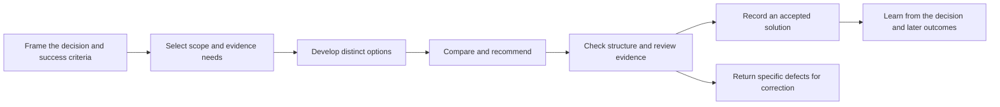

# Evo loop: general solution strategy progress

Date: 2026-09-10, Asia/Taipei. Scope: non-coding strategy and progress summary.
Reviewed repository snapshot: runtime `cfb86638`, including PRs #539, #543 and #544.
This report changes no runtime behavior and does not restart the paused loop.

## Assessment

**The planned foundation for non-coding solution cycles is merged. Useful,
economical delivery through a live solution cycle is not yet demonstrated by
the evidence reviewed.** ADR-0099's three implementation slices are complete;
that is an implementation milestone, not proof that the loop produces good
business decisions or achieves their real-world effects.

The general strategy is to use the existing governed cycle to develop and review
multiple possible solutions to a decision problem. The deliverable becomes an
evidence-backed recommendation, while scope control, independent review,
versioning and learning remain part of the same pipeline.

The current `solutions/` inventory contains only `README.md`. The earlier fleet
attempts exercised coding work and recovery infrastructure; they do not count
as validation of non-coding strategy output. The requested two completed
verification waves remain outstanding, and the operator's pause remains in force.

## What has been built

| Milestone | Result | Verified status |
|---|---|---|
| Recognize non-code work | Scout/Triage can declare `document`; goal types select relevant recipes. Document cycles can release the code-specific TDD requirement. Missing or invalid declarations conservatively retain code behavior. | [PR #539](https://github.com/mickeyyaya/evolve-loop/pull/539), merged |
| Define an accepted deliverable | A configurable solution directory holds at least two options, a recommendation and an assumptions/evidence document. One checker serves the Build handoff, CLI self-check and Audit gate. | [PR #543](https://github.com/mickeyyaya/evolve-loop/pull/543), merged |
| Give phases appropriate instructions | Solution Scout frames the decision; Solution Build develops distinct options and compares them; Solution Audit checks evidence, applies rubrics and challenges the recommendation. Selection uses document-kind signals at dispatch. | [PR #544](https://github.com/mickeyyaya/evolve-loop/pull/544), merged |
| Establish reusable process controls | Earlier recovery work strengthened evidence binding, task-context delivery, confinement, resume and prompt transport; unsupported capabilities were documented explicitly. | See [recovery validation](2026-09-09-recovery-validation.md) |
| Establish usefulness and efficiency | No completed solution pack or live non-code outcome was found in the reviewed deliverable inventory. | Pending |

For each of #539, #543 and #544, GitHub reports SUCCESS for configuration
validation, Linux Go build/test, macOS Go build/test and durable ACS checks.
Relevant tests cover document contract failures, positive acceptance, Audit
enforcement, task binding and dispatch of solution instructions. These checks
support the implementation; they do not measure strategy usefulness. No tests
or provider calls were rerun to produce this summary.

## How the general strategy works



1. **Frame a decision.** State the decision owner, target, baseline, constraints,
   horizon and exclusions. Separate known facts from assumptions and unresolved
   questions. This prevents an attractive document from answering the wrong question.
2. **Choose only relevant work.** The advisor shapes the cycle using available
   phases. Shipped recipes include strategy options, business plans and partnership
   deals. Market sizing, forces analysis, scope definition and risk review are
   available where they help; catalog availability alone does not justify running them.
3. **Develop alternatives before selecting a winner.** Options must differ in
   mechanism, such as changing the customer, payer, delivery approach or cost driver.
   Different sizes of the same proposal are not meaningful alternatives.
4. **Compare on common criteria.** Explain expected effect, assumptions, resources,
   time to effect, risks and early failure signals. Recommend a winner, name the
   runner-up, and identify evidence that would reverse the choice.
5. **Review independently.** Check both the deliverable contract and the substance.
   Trace quantitative claims to sources or explicit assumptions. Make the strongest
   evidence-based case for the alternatives before accepting the recommendation.
6. **Record and learn.** Preserve the accepted version, rejection reasons and
   remaining uncertainties. Later outcome feedback should update the recommendation;
   committing a document is not evidence that its proposed intervention worked.

Steps describing later business-outcome feedback are strategic objectives, not
a claim that automatic outcome collection has been implemented or demonstrated.

## What a completed solution contains

```text
solutions/<task-slug>/
  options/
    1-first-approach.md
    2-second-approach.md
  recommendation.md
  assumptions-and-evidence.md
```

The registry requires comparison and recommendation sections, assumptions and
evidence sections, nonempty content, a minimum option count, and absence of named
placeholders. Options and the recommendation must reference the evidence file.

**Structural acceptance and decision quality remain separate.** The current
checker looks for the evidence filename; it does not establish a valid citation
for every number, validate the source's meaning, or prove that two options differ.
Those judgments belong to the solution audit instructions and task-specific rubrics.
They still need live validation against misleading but well-formed documents.

Non-coding applies to the output. The runtime remains Go, the existing repository
regression checks remain relevant, and Ship still records the solution through
Git. A mixed code/document task remains a code cycle. The project-level `writing`
or `research` domain can supply a document default; legacy `file-save`, `export`
and alternative isolation vocabulary are not implemented runtime mechanisms.

## Lessons incorporated into the strategy

The [token-waste investigation](2026-09-09-token-waste-root-cause.md) changed the
validation approach. More phases and more retries did not reliably produce more
useful output. Three lessons apply directly to general solution work:

| Observed problem | Strategic response | Remaining status |
|---|---|---|
| Passing checks missed downstream behavior and incomplete scope. | Keep original acceptance criteria visible through selection, creation and review; evaluate the actual decision artifact and its consumer. | Requires a live solution demonstration |
| Known missing phases and handoff corrections triggered costly agent runs. | Use deterministic checks first; distinguish document correction, substantive reconsideration and infrastructure failure. | Runtime waste repairs remain pending in the investigation record |
| Repeated full fleet attempts accumulated cost before one useful landing existed. | Validate one bounded solution cycle before scaling to concurrent waves. | Proposed next validation sequence; not started |
| Cancellation left provider sessions alive. | Make pause terminate owned work reliably before resuming autonomous execution. | Reproduced locally; a required recovery prerequisite |
| Some provider usage was unmeasured. | Report measured and unmeasured usage separately; never interpret zero dollars as free execution. | Complete cross-provider accounting remains unverified |

Claude deep/top were verified as `opus`; Codex deep/top were changed to
`gpt-5.6-sol` through the local runtime override. Model selection reduces the
chosen model tier's expense only to the extent actual provider pricing and usage
support it; no savings measurement is claimed. Avoiding unnecessary work remains
the more fundamental strategy.

## Next validation, after the pause is lifted

1. **Resolve the known operational prerequisites.** Reliable stop behavior,
   inexpensive handling of known optional absences, and consistent integration
   bases come before further autonomous spend.
2. **Select one bounded non-code decision.** Use an actual owner, an explicit
   question, available evidence and a small set of acceptance criteria. Agree the
   time/usage limits and what result would be useful before dispatch.
3. **Produce one complete solution pack.** Require distinct options, comparable
   assumptions, a justified recommendation and explicit uncertainty. A supported
   conclusion that the target is infeasible is a valid outcome.
4. **Challenge both gates.** A complete, supported pack should pass; missing options,
   unsupported numbers, misleading citations, duplicate options and an unjustified
   recommendation should be rejected by the appropriate structural or judgment check.
5. **Confirm delivery and usefulness.** Verify the accepted version actually landed,
   record the owner's assessment, and account for phase calls, retries, elapsed time
   and measured/unmeasured usage. A PASS label alone is insufficient.
6. **Then run the two verification waves.** Judge whether subsequent work improves
   the solution using earlier findings, with repeatable acceptance and controlled
   spend. Keep attempted cycles, accepted artifacts and actual outcomes distinct.

This sequence is a recommendation for resuming validation, not an automatic
restart or a newly imposed runtime budget. No new review fleet is needed merely
to summarize progress. Future architecture changes retain the requested
architecture review before landing.

## Source record

- [ADR-0099 at the reviewed solution-skills commit](https://github.com/mickeyyaya/evolve-loop/blob/fc3cd0d33271271294942f869b33d1e05854a32c/docs/architecture/adr/0099-deliverable-kinds.md): scope, decisions and implementation slices.
- [Domain adapter contract](https://github.com/mickeyyaya/evolve-loop/blob/fc3cd0d33271271294942f869b33d1e05854a32c/docs/domain-adapters.md): implemented defaults and unsupported legacy fields.
- [Solution checker](https://github.com/mickeyyaya/evolve-loop/blob/fc3cd0d33271271294942f869b33d1e05854a32c/go/internal/solutioncheck/solutioncheck.go): structural enforcement and its limits.
- [Solution skills](https://github.com/mickeyyaya/evolve-loop/tree/fc3cd0d33271271294942f869b33d1e05854a32c/skills): Scout, Build and Audit instructions; read as sources for this summary, not invoked.
- [Example document eval](https://github.com/mickeyyaya/evolve-loop/blob/fc3cd0d33271271294942f869b33d1e05854a32c/examples/eval-solution.md): deterministic check plus model-judged rubrics. This is an example, not a delivered strategy.
- Local recovery reports linked above: supporting reliability work and the evidence behind the pause.
