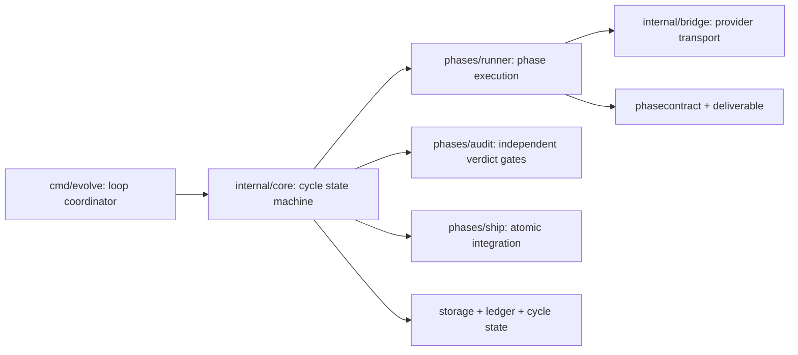

# Large-component decomposition and TDD recovery plan

**Date:** 2026-09-11
**Original analysis snapshot:** `10978424`
**Promotion integration base:** `c1ba55a0` (`runtime/main`)
**Status:** primary decomposition merged; supplemental rescans and post-fix live validation are in progress

**Architecture review:** initial verdict `REVISE`; the plan incorporated those findings before implementation. The final implementation review passed after one TDD correction and accepted the narrower behavior-preserving boundaries recorded below.

## Approved scope adjustments

Two proposed end states require new behavioral designs, so they are not represented as completed extraction work:

1. `driver_tmux_wait.go` contains the effectful completion state machine. The surrounding preparation, boot, prompt delivery, live channel, final capture, and disposition are isolated, but a pure `nextWaitAction` reducer was not introduced. Pane capture order, inbox draining, persistence gates, reviewer callbacks, prompt injection, and cancellation-detached final polling consume observable events. A pure reducer first needs an explicit event model and discriminating tests; treating it as a mechanical move would not be behavior preserving.
2. Fresh and resumed cycles share the durable phase-completion boundary in `phase_completion.go`, not one complete dispatch engine. The compatibility table below identifies fresh-only parallel evaluation/remediation/advisory routing and resume-only legacy handling. Combining them without a policy change would hide real differences behind flags and increase risk.

These adjustments keep the large facades contained and independently navigable while avoiding abstractions that claim false equivalence. The architecture reviewer approved them as honest limits of this behavior-preserving campaign.

## Decision

The implementation has real component boundaries, but several of its most frequently changed workflows have outgrown those boundaries. The main issue is not the total amount of Go code. It is that seven functions combine policy decisions, resource ownership, external I/O, retries, persistence, observability, and terminal-result mapping in one control flow.

The design documentation also cannot be used as the source of truth for this refactor. `docs/architecture/phase-architecture.md` still describes the removed shell dispatcher, claims Intent is always on, and assigns enforcement to shell hooks. The live contract is Go-only: `evolve loop`, `go/internal/core`, the native phase runner, and `go/internal/bridge`. The first deliverable must therefore be an accurate current-state component map and invariant list. Implementation planning against the existing architecture page would reproduce obsolete boundaries.

The recovery should be a sequence of small, behavior-preserving extractions in existing packages. New packages and exported interfaces are not the default. A boundary should become a package only after its contract is stable, independently testable, and free of dependency cycles.

## Evidence and method

A temporary Go AST scanner inspected production `.go` files, excluding tests and vendor code. It measured physical size, function size, an approximate Sonar-style cognitive-complexity score, internal package fan-in/fan-out, and six-month file churn from Git. The complexity number is a ranking aid rather than a quality verdict.

The scan was then checked against the actual control flow and existing tests. Large schema files were kept separate from large workflow functions: a 2,000-line file made of short declarative functions is a lower immediate risk than a 1,000-line stateful function.

| Rank | Current component | Largest function | Lines / approximate complexity | Six-month changes | Package coupling | Finding |
|---:|---|---|---:|---:|---|---|
| 1 | `go/cmd/evolve/cmd_loop.go` | `runLoopBatch` | 962 / 251 | 95 | entry point fans out to 123 internal packages | Batch lifetime, recovery, resume, preflight, scheduling, breakers, classification, and closeout are one procedure. |
| 2 | `go/internal/bridge/driver_tmux_repl.go` | `runTmuxREPL` | 986 / 230 | 80 | bridge: fan-in 12, fan-out 27 | Session ownership, boot, prompt delivery, live interaction, liveness, completion, forensics, and teardown share mutable state. |
| 3 | `go/internal/phases/runner/runner.go` | `(*BaseRunner).Run` | 732 / 121 | 72 | runner: fan-in 12, fan-out 18 | The existing Template Method is sound, but its implementation has become a phase execution pipeline hidden inside one method. |
| 4 | `go/internal/core/cyclerun_review.go` | `(*cycleRun).reviewAndGuard` | 477 / 137 | 18 | core: fan-in 39, fan-out 59 | Review, correction, escalation, salvage, evidence, normalization, explanation sealing, and leak guarding are coupled. |
| 5 | `go/internal/core/resume.go` | `(*Orchestrator).RunCycleFromPhase` | 445 / 112 | 43 | core is the most central package | Resume implements a second lifecycle path and repeatedly requires parity fixes with the normal cycle path. |
| 6 | `go/internal/phases/audit/audit.go` | `hooks.Classify` | 414 / 69 | 44 | Audit fans out to 24 packages | Evidence collection, deterministic gates, precedence, verdict conflict reporting, and ledger output are interleaved at a trust boundary. |
| 7 | `go/internal/phases/ship/gitops.go` | `shipFromWorktree` | 239 / 62 | 42 | Ship fans out to 26 packages | A git transaction is expressed as one mutable procedure, making order and failure semantics difficult to verify locally. |
| Defer | `go/internal/policy/policy.go` | largest function | 92 / lower | 77 | policy fan-in 27, fan-out 3 | The 1,982-line file is large, but its 46 functions are short. It needs file-level organization after the workflow risks, not a new policy framework. |

Other large files such as `phase_advisor.go`, `explanationdocs.go`, and `inboxmover.go` contain smaller functions and do not enter the first campaign. They should be rescanned after the seven workflows are contained.

### Supplemental rescan: the release CLI's two `Run` procedures

The same post-campaign rescan ranked two functions the first campaign never
examined above several it did. Both are in the release path, both are reached
only by `evolve release`, and neither is named in the table above:

| Function | Lines / approximate complexity | Disposition |
|---|---:|---|
| `releasepreflight.Run` | 252 / 84 | Extracted — the highest score measured anywhere in the repo, above four of the seven original targets. |
| `releasepipeline.Run` | 206 / 34 | Extracted — six pre-publish steps repeating one shape verbatim. |

Both follow the behavior-preserving protocol above, and both use the patterns
this plan already declares: a parameter object (`preflightRun`, `releaseRun`)
modelled on `phases/ship`'s `worktreeShip`, plus — for preflight only — an
ordered stage table so that step ORDER becomes a data structure a test can
assert against rather than control flow a reader must trace. Neither adds an
exported identifier or a package import.

**These two slices are why the protocol now treats operator-facing strings as
contract.** The preflight slice shipped two error-string drifts. The suite
caught one (`"step 2 branch error"` for `"step 2 git error"`). It could not
catch the second — `"HEAD is detached"` written where the original said
`"detached HEAD"` — because every assertion tested the looser substring
`"detached"`; two independent reviewers found it. An error message that reaches
the operator through the CLI is observable behavior, not log wording, and the
distinction matters for TDD protocol rule 2: a characterization test may skip
log phrasing, but not the text a failure prints.

Two practices were added in response, and both are cheap enough to keep:

1. Characterization tests assert failure messages by EXACT equality, not
   substring. The pipeline slice's six pre-publish labels are pinned this way,
   which matters because two of the six deliberately journal under one name and
   report under another.
2. After the extraction, a script extracts every operator-facing string literal
   from the pre-change file and from the new files and diffs the sets. A
   consolidated format string is then verified to recompose byte-for-byte. On
   the pipeline slice this reported zero new literals and six consolidated
   ones, all six verified identical — a mechanical check where the preflight
   slice had relied on reading.

Also found while verifying, and filed rather than fixed: `acs/cycle50` carries
two permanently-RED predicates asserting on `go/cmd/evolve/cmd_release_preflight.go`,
a path that no longer exists (the CLI moved to `internal/cli/opscmd/`). It fails
identically on untouched `main` and is outside CI scope, since the durable tier
runs `./acs/regression/...` only. Queued as inbox item
`acs-cycle50-predicates-point-at-a-moved-file`.

### Supplemental rescan: PhaseAdvisor plan stage

The post-campaign rescan found one small, cohesive value object embedded in
`phase_advisor.go`: `planStage` owns the three mappings that distinguish the
initial plan from the post-Scout re-plan. It is not a new package or public
abstraction. Moving it to `plan_stage.go` gives that decision table one local
home while `PhaseAdvisor.planWith` continues to orchestrate the provider call,
artifact capture, and plan validation. The extraction adds no import, exported
identifier, runtime branch, or external dependency.

This slice follows the behavior-preserving TDD protocol above. The initial and
post-Scout mapping tests passed against the original file. A temporary mutation
that returned `plan` for the post-Scout capture kind made
`TestPlanStage_PostScout` fail by assertion; the mutation was reverted before
the move. The same tests then exercised the extracted component unchanged.
Review removed the diagnostic wave's source-text ownership assertion because
literal spelling and file placement are not behavioral contracts. The retained
tests cover the complete stage mapping and the documented zero-value invariant.

## Boundary rules

These rules keep the refactor maintainable instead of merely distributing lines across files.

1. Preserve each existing public facade: `runLoopBatch`, `runTmuxREPL`, `BaseRunner.Run`, `RunCycleFromPhase`, `hooks.Classify`, and `shipFromWorktree` remain the entry points while their bodies become orchestration only.
2. Extract inside the current package first. Do not add an exported identifier unless an existing consumer outside the package needs the contract.
3. Put decisions in pure functions and side effects behind narrow existing ports. A decision accepts the values resolved for its documented lifetime and returns an action; its caller performs the action. Do not freeze settings that currently reload at a narrower scope, such as `policy.StrictAuditFor`, or copy mutable cross-phase environment/context maps without preserving their semantics.
4. Give every resource one owner. Context cancellation, tmux sessions, locks, worktrees, and output artifacts each have one component responsible for closing or releasing them exactly once.
5. Keep order-sensitive trust logic explicit. Audit precedence and Ship transaction order use named stages and table tests; they must not become a generic middleware framework.
6. Preserve the runner's existing Template Method and optional-provider interfaces. Do not grow `Hooks` or create a general dependency-injection container.
7. Prefer concrete, domain-named structs over generic `Manager`, `Service`, or `Util` types. Comments document invariants and reasons rather than restating the code.
8. Keep process-global environment reads at the outer boundary. Internal components receive an immutable configuration snapshot, clock, and command/session ports where determinism requires them.

The patterns used deliberately are a functional core with an imperative shell for policy, an explicit state machine for REPL waiting, a parameter object for per-phase execution, Template Method for phase specialization, and a transaction script for Ship. More elaborate State, Strategy, or repository abstractions should be rejected unless a second concrete implementation requires them.

## Strict TDD protocol

Every slice follows the same gate. A behavior-preserving refactor starts from working behavior, so it uses the TDD skill's explicit refactor exception: existing or new public-seam characterization stays GREEN while the structure changes. A new behavior or defect fix still requires a true assertion-level RED on the unmodified implementation.

1. **Baseline GREEN:** run the package tests with `-count=1` and record coverage, race status where practical, exported symbol count, package fan-out, and the target function's size/complexity.
2. **Characterize the invariant:** add or identify a test at the current public seam for success, cancellation, and the relevant failure boundary. It must assert observable behavior, not log wording or helper call count unless order is part of the contract.
3. **Prove the test is sensitive:** temporarily apply an explicit wrong result, omitted cleanup, reordered stage, or inverted decision and observe an assertion-level failure. Revert the mutation before production extraction. A compile failure is never accepted as RED evidence.
4. **REFACTOR under GREEN:** extract the smallest coherent stage, rerun the same test unchanged, then remove only duplication introduced or exposed by that extraction.
5. **New behavior/bug protocol:** if the slice intentionally changes behavior or exposes a defect, stop the refactor, write a regression test that fails by assertion on the unmodified implementation, add preservation tests for neighboring behavior, then implement the minimum GREEN fix as a separate change.
7. **Local verification:** run the component's table tests, its former public-seam characterization tests, the full package, and `go test -race` for concurrency/resource slices.
8. **Integration verification:** run direct dependants, `go vet ./...`, the repository's commit gate, and any relevant real-tmux or real-git integration fixtures.
9. **Review gate:** a Go test reviewer checks determinism and failure coverage; an architecture reviewer checks boundaries, dependency direction, and accidental framework growth. Findings are fixed before the next slice.

Package-local component tests are added only when they verify a stable decision contract; they must not force a chosen helper shape. Public behavior tests plus a demonstrated failing mutation are sufficient for mechanical extraction. If a defect is discovered, its fix becomes a separate slice with a true failing behavioral regression test and must not be hidden inside the extraction.

## Ordered implementation slices

The program is intentionally sequential. The CLI reads Core and Bridge; the runner reads Bridge and phase contracts; Audit and Ship read the runner/Core contracts; Policy is read by nearly every target. Parallel work on these files would create read/write conflicts and make failures ambiguous. One focused branch or worktree and one reviewable commit per slice provides better isolation than artificial agent parallelism.

### 0. Repair the architectural contract

**Write set:** `docs/architecture/phase-architecture.md`, optionally a small diagram source under `docs/architecture/`.

Replace the shell-era pipeline with the current Go runtime map:

The following diagram describes **runtime calls and composition**, not Go import direction:



`cmd/evolve` remains the composition root that wires concrete phases. Core continues to dispatch through its ports; it must not import Runner, Audit, or Ship implementations.

Document Go-only execution, optional Intent policy, fresh/resume paths, phase order, bridge ownership, Audit precedence, and Ship atomicity. Validate every file/path claim with `rg` and link it to current code. This slice has no runtime behavior and therefore uses documentation validation rather than fabricated RED/GREEN tests.

**Exit:** the architecture page contains no live instructions for `run-cycle.sh`, `phase-gate-precondition.sh`, or `subagent-run.sh`; historical details link to `docs/migration-from-bash.md`.

### 1. Contain batch lifetime and startup in `cmd/evolve`

**Goal:** make process and batch ownership explicit before changing scheduling.

**Proposed package-local components:**

- `loopBatchRuntime`: owns signal context, derived tmux socket, orphan-session startup GC, and idempotent teardown. It destroys only an ephemeral socket owned by this batch; inherited/operator sockets have a distinct disposition.
- `batchBootstrap`: loads dependencies/config snapshots, prunes state, applies reset, performs boot recovery, unfinished-cycle checks, and preflight.
- `resumeBatch`: owns the resume-only branch and maps its result to the batch exit contract.

**TDD slices:**

1. Derived socket is killed exactly once on success, failure, and cancellation; an operator-provided or enclosing-run socket is never killed.
2. Bootstrap stage order is fixed: binary refresh → recovery → unfinished guard → readiness gate → start sweep. Each injected failure stops at the documented boundary.
3. Resume restores the discovered per-run state path and reaps only ephemeral sessions owned by the completed invocation. Named sessions and resumable worktrees follow their existing preservation rules.

**Files:** add `cmd_loop_runtime.go`, `cmd_loop_bootstrap.go`, and `cmd_loop_resume.go` beside existing `cmd_loop_*.go`; reuse existing seams instead of exporting new ones.

**Exit:** `runLoopBatch` no longer owns individual startup resources and remains behavior-identical under existing loop tests.

### 2. Extract the batch decision reducer and window executor

**Goal:** separate “what should happen next” from running a sequential cycle, fleet wave, or rolling pool.

**Proposed components:**

- `batchState`: consecutive failures, same-cycle streak, goal/non-progress streaks, budget, starvation, and batch result.
- `batchObservation`: immutable facts from the just-finished cycle/window.
- `nextBatchAction`: pure reducer returning continue, stop, pause, escalate, or fatal plus a reason.
- `windowExecutor`: dispatches exactly one sequential cycle, wave, or pool window and returns a common observation.
- `batchCloseout`: final sweep, fail-open roll-up, report emission, and exit-code mapping.

Keep existing breaker and classifier packages authoritative; the reducer composes their results and must not reimplement their rules.

**TDD matrices:** signal before dispatch; plane divergence; quota exhaustion; system failure; task failure below/at ceiling; same-cycle threshold; consecutive FAIL threshold; alternating FAIL/EMPTY non-progress; budget completion; fleet starvation; and normal max-cycle completion. Each row asserts action, stop reason, state update, and whether another dispatch is permitted.

**Exit targets:** `runLoopBatch` ≤ 150 lines, no hidden dispatch inside the reducer, and no new package dependency from `cmd/evolve`.

### 3. Turn the tmux REPL procedure into an explicit lifecycle

**Goal:** isolate the highest token-cost resource boundary while preserving the existing tmux protocol.

**Proposed components:**

- `replSession`: create/attach, registry entry, pane identity, admission slot, and exactly-once disposition. Disposition is explicit: destroy ephemeral session, preserve named session, and always release invocation admission.
- `bootREPL`: boot deadline, interactive boot responses, shell-spill detection, and readiness latency.
- `deliverPrompt`: artifact baseline, initial input, paste-buffer transport, redraw wait, and submit verification.
- `waitSnapshot` plus `nextWaitAction`: a pure state transition over progress, pane liveness, artifact evidence, exhaustion/fatal/transient matches, live-channel activity, and deadlines.
- `waitForCompletion`: polls dependencies, applies `nextWaitAction`, records interaction outcomes, and performs bounded nudges/reviews.
- `captureREPLResult`: final poll, raw/clean scrollback, marker lines, and terminal exit mapping.

Use a small enum for actions (`continue`, `complete`, `review`, `quota`, `fatal`, `transient`, `cancelled`, `timeout`). Avoid an interface per state; the transition table is the abstraction.

**TDD matrices:** new vs named session; boot-only; boot timeout; trust/update dialogs; multiline prompt and Codex paste chip; delivery failure; artifact completion; cancellation-detached bounded final-poll success/failure; quota persistence; fatal-pane persistence; transient dwell; render wedge; nudge verification; live injection; dead pane; timeout forensics; destroy-ephemeral/preserve-named disposition; and admission release on every terminal action.

Use fake tmux for the RED/GREEN loop, then run the existing real-tmux fixture once per completed slice. Tests must pin environment lookup and use a dedicated tmux socket.

**Exit targets:** `runTmuxREPL` ≤ 120 lines, wait decisions independently table-tested, exactly one session owner, and `go test -race ./internal/bridge` passes.

### 4. Expose the phase execution pipeline inside `phases/runner`

**Goal:** keep `BaseRunner` as the stable facade while giving each execution step one responsibility.

**Proposed unexported parameter object:** `phaseExecution`, containing the request snapshot, phase/profile names, contract roots, artifact baseline, resolved policy/routing, and accumulated attempt evidence.

**Proposed stages:**

1. `preparePhaseExecution`: optional skip, persona/prompt/profile load, challenge and explanation context.
2. `resolveDispatchPlan`: policy pin, CLI/tier candidates, capability/health ordering, universal fallback, and immutable per-attempt overlays.
3. `dispatchPhaseAttempts`: worktree fence, bridge calls, attempt log, and terminal attempt selection.
4. `reconcileDeliverable`: cancellation-immune teardown reconciliation, stale-artifact rejection, ACS rescue floor, and single-read verified bytes.
5. `classifyPhaseOutcome`: hooks classification, authoritative verdict source, ship guard, diagnostics, and clean stdout companion.

Do not split or expand `Hooks`. Existing optional interfaces remain the extension mechanism.

**TDD matrices:** missing optional/mandatory persona; policy pin; unavailable CLI; health bench; tier fallback; per-attempt overlays; cancellation; bridge timeout with valid, stale, malformed, or missing deliverable; ACS rescue; contradictory pane/report verdicts; and worktree-fence failure.

Also pin three runner invariants before extraction: `WorktreeVerified` is cleared on entry; one worktree fence spans the entire fallback chain; and fence restoration completes before reconciliation or classification. “Attempt state cannot leak” means attempt-local routing and evidence do not leak; the extraction does not alter the existing shared workspace or fence lifetime.

**Exit targets:** `BaseRunner.Run` ≤ 100 lines, verified artifact content is read once, attempt-local state cannot leak between candidates, and all phase packages pass their existing runner integration tests.

### 5. Separate review correction from post-phase guarding in Core

**Goal:** remove the correction state machine from the tree-integrity guard without changing fail-closed behavior.

**Proposed components:**

- `reviewContext`: phase response, worktree, routing, and contract evidence, with the response refreshed after a corrective redispatch.
- `prepareForReview`: performs `recoverBeforeReview` and host normalization before the initial review and before every corrected re-review. Recovery failure prevents reviewer execution and success recording.
- `reviewWithCorrections`: owns review, bounded rung budget, salvage, corrective redispatch, escalation, interaction records, restoration of temporary request fields, and the required `prepareForReview` call before every review.
- `correctionAttempt`: performs one redispatch and returns a typed outcome; it does not choose the next rung.
- `applyPostReviewGuards`: explanation refresh, Ship-success latch, binary cleanup, final leak filtering/quarantine, and tree-diff verdict. It does not own pre-review recovery.

Continue to use `interaction.NextCorrection` as the correction policy. The extraction must not create a second ladder implementation.

**TDD matrices:** initial recovery and normalization are visible to the reviewer; corrected recovery and normalization are visible to re-review; recovery failure prevents review and success recording; immediate approve; no correction budget; salvage success/reject/invalid/missing; repeated identical block with cross-family escalation; no target with structured re-prompt; different defect identity; noncanonical corrected verdict; redispatch error; temporary routing/directive restoration; post-Build explanation refresh; registered mint waiver; corrupt registry; and real tree leak.

**Exit targets:** `reviewAndGuard` ≤ 100 lines, every loop iteration consumes a rung or terminates, and post-review guards can be tested without invoking a provider.

### 6. Make resume enter the normal cycle engine

**Goal:** eliminate the second phase lifecycle that repeatedly drifts from fresh execution.

First write a compatibility table for every fresh/resume difference and classify it as intentional compatibility, an existing defect, or shared behavior. The initial table must include deterministic resume history branching versus fresh advisory routing, resume's exclusion of the live debugger override, legacy explanation-contract skipping, fresh parallel evaluation, and the fresh remediation boundary. Proceed only after those differences have tests or explicit preserved exceptions.

The compatibility inventory below is the refactoring contract. “Preserved exception” means this change may move the code but may not silently enable the fresh-only behavior on resume; changing that row requires a separate behavioral proposal and a discriminating RED test.

| Concern | Classification | Required behavior during this refactor | Evidence |
| --- | --- | --- | --- |
| History successor after Retro | Intentional compatibility difference | Resume continues to call deterministic `decideAfterRetro`; fresh execution may use `decideAfterRetroRouted` when advisory routing is enabled. This is a preserved exception. | `TestDecideAfterRetro_AllBranches`; the explicit resume branch in `resume.go` |
| Debugger successor override | Intentional compatibility difference | Resume continues through the state-machine successor and does not invoke the fresh live-debugger override. This is a preserved exception. | The explicit exclusion beside the resume history branch; a behavior change requires its own RED test |
| Explanation contract version `0` | Intentional legacy compatibility | Resume accepts the inactive legacy contract and skips lifecycle review; activated checkpoints remain identity-bound and reviewed. | `TestRunCycleFromPhase_ResumedBuildUsesCorrectionAndLifecycleReview`, `TestRunCycleFromPhase_RejectsCycleAndVersionRewriteThatHidesHostActivation`, `TestRequireResumeExplanationIdentity_RejectsLegacyDowngradeAgainstAuthoritativeCycle` |
| Parallel evaluation batch | Fresh-only behavior | Resume remains sequential and does not begin a new parallel evaluation batch while replaying a checkpoint suffix. This is a preserved exception because the checkpoint contains a single cursor, not a batch frontier. | Fresh path coverage in `bytestability_test.go`; a resume behavior change requires a checkpoint-frontier design and RED test |
| Remediation boundary | Fresh-only behavior | Resume does not insert the fresh post-gate remediation workflow. It resumes the persisted phase spine and retains its audit-repair grant behavior. This is a preserved exception. | Fresh remediation coverage in `cyclerun_remediate_test.go`; resume repair continuity in `audit_repair_context_test.go` and `resume_lifecycle_test.go` |
| Dynamic inserted-phase successor | Shared behavior | Resume rehydrates the run transition plan rather than rejecting a non-static phase. | `TestRunCycleFromPhase_InsertedPhaseTransitionsViaPlan`, `TestRunCycleFromPhase_MissingPlanDegradesNotInvalidPhase` |
| Worktree, run ID, goal, and cycle identity | Shared behavior | Resume restores and validates the persisted identities before dispatch. | `resume_goal_test.go`, `resume_explanation_identity_test.go`, `orchestrator_runid_threading_test.go` |
| Audit round retirement and repair grants | Shared behavior | A resumed Audit supersedes its previous round; repair and bookkeeping grants remain bounded and persisted. | `audit_round_artifacts_test.go`, `audit_repair_grant_test.go`, `bookkeeping_regrade_test.go`, `resume_lifecycle_test.go` |
| Review preparation | Shared behavior for activated contracts | Recovery precedes normalization and review on initial and corrected dispatches. Legacy inactive contracts retain the exception above. | `resume_explanation_correction_test.go`, `resume_normalize_test.go` |
| Outcome/timing/final-verdict recording | Shared behavior | Every dispatched terminal disposition reaches the shared recording and floor primitives. | `orchestrator_timing_resume_test.go`, `resume_verdict_integration_test.go`, `phaseoutputs_signal_resume_test.go` |

Then proceed in four narrow slices:

1. Extract `resumeBootstrap` for state/lease/run-record restoration and validate all resume identities.
2. Extract a `cycleCursor` containing current phase, transition plan, and restored audit round.
3. Extract from the already-factored fresh `cycleRun` path a common phase step that preserves `loopAction`, parallel-evaluation placement, remediation, review, and recording boundaries; adapt resume to it without enabling fresh-only behavior.
4. Make fresh execution use the same method, then delete duplicated resume parity logic.

Do not unify state discovery (`LoadResumeState`) with execution. Discovery is already independently testable and has different filesystem failure semantics.

**TDD matrices:** singleton and per-run fleet checkpoints; owner lease; context/env snapshot; dynamic transition plan; optional phase; audit round retirement; normalization; review rejection/correction; floor verdict; history branch; bookkeeping regrade; system failure; Ship success; post-Ship observer; pause/cancellation; and cleanup/reporting parity with fresh execution.

Add a differential test that runs equivalent suffixes of the same fake phase sequence fresh and from a checkpoint, then compares shared phase outcomes, ledger roles/kinds, timings shape, final verdict, and retained/cleaned worktree behavior. The test explicitly lists intentional differences rather than demanding false byte parity. Any change to one of those differences is a separate behavioral fix with a true RED regression test.

**Exit targets:** `RunCycleFromPhase` ≤ 150 lines and no `resume-parity` behavior remains implemented in a resume-only branch when a shared cycle primitive can own it.

### 7. Split Audit classification into evidence, gates, and verdict arbitration

**Goal:** make the fail-closed trust boundary locally auditable.

Audit is an ordered evidence lifecycle, not a collect-everything-then-reduce pipeline. **Proposed values/functions:**

- `auditEvidence`: parsed narrative verdict plus host-generated ACS, formatting, skills-drift, CI-parity, solution, closure, and defect-lineage facts.
- `prepareAuditEvidence`: quarantines probes, retires candidate evidence, invalidates/prepares host evidence, generates predicates, and returns the late sealing callback.
- `executeAuditGates`: runs and reads gates in the existing order.
- `auditGateResult`: gate name, diagnostic severity, independent blocking disposition, evidence source, and unavailable/failed status.
- `applyAuditPrecedence`: pure ordered reduction where host gates outrank narrative prose.
- `recordAuditDisposition`: preserves current conflict-record and defect-ledger timing.
- `sealAuditEvidence`: invokes the returned seal after current disposition recording and may still force the returned verdict to FAIL.

The precedence table must be data-visible and exhaustive. A new gate requires a named precedence test.

**TDD matrices:** quarantine before predicates; evidence retirement/preparation order; narrative PASS/WARN/FAIL/unparseable crossed with each host gate's pass/fail/unavailable result; predicate errors fail closed; unavailable gofmt and solution checks warn without blocking; multiple simultaneous gates; strict WARN promotion; ACS do-not-ship; phantom bindings; closure laundering; conflict record; current pre-seal ledger timing; and a late seal failure forcing the returned verdict to FAIL.

**Exit targets:** `hooks.Classify` ≤ 100 lines, pure precedence tests cover every gate, and a collector error cannot silently manufacture PASS.

### 8. Express Ship as a typed, ordered transaction

**Goal:** keep atomic integration and failure identity visible while reducing mutable procedure scope.

**Proposed unexported parameter object:** `shipTxn`, containing options, worktree, branches, audit binding, staged paths, candidate commit/tree, and result.

Preserve the current path-specific locks: `shipDirect` and `shipFromWorktree` each acquire and release their own integrator lock; `atomicShip` remains only the path selector. **Ordered worktree stages:**

1. validate the worktree, collider set, and manifest;
2. normalize sanctioned binary churn and consume sanctioned inbox changes;
3. stage the explicit cycle paths;
4. verify the resulting staged tree against the audit binding, including only the existing narrow consumption-drift exception;
5. create or identify the candidate commit;
6. integrate or return the typed fleet-rebase requirement;
7. push with the existing fetch/fast-forward retry policy;
8. verify local `HEAD^{tree}` after push and perform the existing best-effort Ship-binding write.

Stage functions return existing typed `ShipError` values; they do not log-and-continue unless the present contract explicitly does so. The best-effort binding-write behavior remains unchanged unless a separate RED/GREEN bug-fix slice changes it.

**TDD matrices:** no-op branch; explicit/deleted/ignored paths; stage refusal; binary churn; collider; audit staged-tree mismatch creates no commit; sanctioned consumption drift; unexplained drift cannot use the exception; manifest mismatch; commit-prefix failure; expected fleet divergence; unexpected divergence; push race retry; local post-push tree mismatch; best-effort binding write failure; and path-specific lock release for every result.

Run fake-command table tests first, then existing real-git tests in temporary repositories.

**Exit targets:** `shipFromWorktree` ≤ 100 lines, transaction stage order is asserted, no push can occur before audit/tree verification, and all failure codes remain stable.

### 9. Reorganize Policy without changing its facade

**Goal:** make policy definitions navigable after the runtime workflows no longer move beneath them.

Split the current same-package file by domain: core workflow types, routing/model policy, retry/recovery, fleet/budget, gates/audit, paths/worktrees, defaults, loading, and validation/accessors. Keep `Policy`, `Load`, JSON keys, default values, and environment precedence as the single public facade.

Use existing wire/default tests as characterization. Add no interfaces and no new package. A generated or reflection-based inventory may detect omitted JSON fields, but semantic table tests must preserve missing-file behavior, malformed-file behavior, pointer-based unset/false distinctions, accessor defaults, and environment/policy precedence.

**Exit:** no production function grows, `policy.go` becomes a small facade or disappears into domain-named files, and policy package fan-out remains 3 or lower.

## Per-slice verification command shape

Run commands from `go/` and substitute the package under change:

```text
go test -count=1 ./internal/bridge
go test -race -count=1 ./internal/bridge
go test -count=1 ./internal/phases/runner ./internal/phases/audit ./internal/phases/ship
go test -count=1 ./internal/core ./cmd/evolve
go vet ./...
```

The exact repository commit-gate command must be taken from the current `evolve commit-gate` help at execution time. Real provider calls are excluded from unit/characterization tests. Real tmux and real git use local deterministic fixtures; live model calls occur only in the final two-wave validation.

## Measurable architecture gates

At the end of each component, regenerate the AST/coupling report and compare it with the baseline.

| Gate | Required result |
|---|---|
| Behavior | Existing public-seam characterization and integration tests stay green. |
| Function control flow | Target facade meets its exit line target; extracted decision functions have approximate cognitive complexity ≤ 25. |
| Coupling | No new import cycle; target package fan-out does not increase without an architecture-review finding that justifies it. |
| API | No new exported symbol by default; additions require an outside-package consumer and contract test. |
| State | Internal execution snapshots are immutable after construction except for one clearly owned result/state object. |
| Resources | Every terminal path proves its explicit disposition: destroy ephemeral session, preserve named session, release invocation admission, retain resumable worktree, or reap finalized worktree. Cancellation-detached cleanup is bounded; `-race` verifies concurrency safety but is not the sole disposition proof. |
| Tests | Coverage for the touched package does not fall; new decision tables exercise success, boundary, and injected-failure paths. |
| Diff scope | One component and its tests per commit; discovered bug fixes are separate RED/GREEN commits. |

A line target is a guardrail, not permission to create meaningless one-line wrappers. If reaching it would scatter a cohesive invariant, the architecture reviewer may accept a larger facade with a written reason and a lower complexity score.

## Two-wave live validation after implementation

The evolve loop stays paused throughout refactoring. After all affected package tests, race checks, vet, commit gate, Go review, and architecture review pass, run exactly two controlled live waves.

### Wave 1: constrained usefulness proof

Give the loop one bounded goal in a remaining, pre-ranked hotspot outside the just-refactored code. Limit the wave so it cannot expand into a broad cleanup. Before launch, record integration HEAD, provider/session baseline, configured cycle/quota controls, observed token/cost telemetry capability, and expected artifacts. Cost is currently display-only and some providers are cost-blind; the validation must not claim unsupported budget enforcement or invent missing usage values.

Accept the wave only if it:

- selects a task supported by repository evidence;
- produces either a tested material change or a specific evidence-backed no-change decision;
- writes coherent Scout/Build/Audit/Ship/dossier artifacts bound to the same run and tree;
- leaves no leaked provider process, ephemeral tmux session, finalized worktree, or stale active lease after closeout, while preserving any named session or resumable worktree required by its disposition;
- reports available per-phase token/cost observations honestly and respects the actual configured cycle/quota controls;
- passes the normal package and commit gates.

### Wave 2: refreshed-head and independence proof

Start from the integration HEAD produced by Wave 1. Require a fresh digest and select a different remaining hotspot or a clearly independent slice. The wave must not rediscover or overwrite Wave 1's task, and any fleet lane must base from the refreshed integration head.

Apply the same usefulness and hygiene checks, then compare the waves on task novelty, accepted material delta, audit findings, elapsed time, retries/corrections, token usage, and cleanup. Two green wave processes with empty or cosmetic output do not count as success.

If either wave fails a correctness or resource gate, stop before another live run, convert the observation into a deterministic failing test, repair it through the same TDD protocol, and repeat only the failed wave.

## Definition of done

The campaign is complete when:

1. the current architecture document matches the Go runtime;
2. all seven workflow facades meet their size/complexity targets or have an approved exception;
3. fresh and resumed cycles share durable completion, with the path-specific execution differences in the compatibility table retained as approved exceptions;
4. REPL resource ownership, Audit precedence, and Ship ordering have independent deterministic tests;
5. package coupling and exported API surface have not grown without evidence;
6. full Go tests, affected race suites, vet, commit gate, Go test review, and architecture review pass; and
7. two controlled live waves produce useful, independently verified results and clean up every owned resource.

## Execution outcome

The seven decomposition slices and the same-package Policy organization were implemented in isolated worktrees and promoted through reviewed PRs #549, #550, #553, #554, #556, and #557. Architecture review approved the effectful REPL waiter and fresh/resume compatibility exceptions. Later reviewed PRs #558, #559, and #560 added centralized telemetry and repaired checkpoint and interruption integration history. A live finding also added one bounded outcome module: failed Triage stops before implementation and retains FAIL; a successful explicit empty-array commitment closes as planned no-work and may use the shortened Scout/Triage ledger-verification floor.

Wave 1 shipped a tested clean-checkout manifest correction in its disposable repository. Wave 2 selected an intentionally protected Go test target. Its first run reached TDD and proved that selection was too late; cycle 1628 then stopped after Intent, Scout, and Triage with its Triage FAIL preserved. The outer loop initially mislabeled that safely shortened failed chain as infrastructure failure. Follow-up RED/GREEN work separated failure termination from successful planned no-work, required an explicit JSON array, made the production Triage classifier recognize that corroborated empty result, and bound shortened verification to the host result. A final paid replay was stopped during Intent when correction escalation paired Claude with a Codex model name and the phase sandbox denied the artifact write. Early termination is established by the real cycle-1628 artifacts; successful no-work closeout is established by a composed production-Triage cycle test plus deterministic resume, ledger, and command-loop tests without spending another provider cycle on already-captured inputs.

All disposable cycle worktrees and sessions were reset or reaped. Every production batch reached `runtime/main` through its reviewed PR; no feature work was committed directly on `main`.

A later post-#560 diagnostic wave independently selected the `planStage`
extraction above and produced a useful production move, but its generated test
and eval evidence included brittle source inspection and test selectors that
could pass while matching no tests. That disposable commit was not promoted.
The extraction is being reconstructed in this isolated branch with the compact
behavioral tests described above, followed by the normal deterministic and
review gates. Accepted live-wave validation will resume with strict Audit WARN
handling after this correction; the diagnostic run does not count as an
accepted wave.

## Explicit non-goals

- No provider/model changes are part of this refactor.
- No rewrite of the Go orchestrator or replacement workflow framework.
- No generic event bus, dependency-injection container, repository layer, or interface for every helper.
- The decomposition slices themselves preserve behavior; the separately identified live-wave gaps use their own RED/GREEN tests and documented behavior changes.
- No Python tooling or production code.
- No live evolve-loop execution until the implementation and deterministic verification gates pass.
