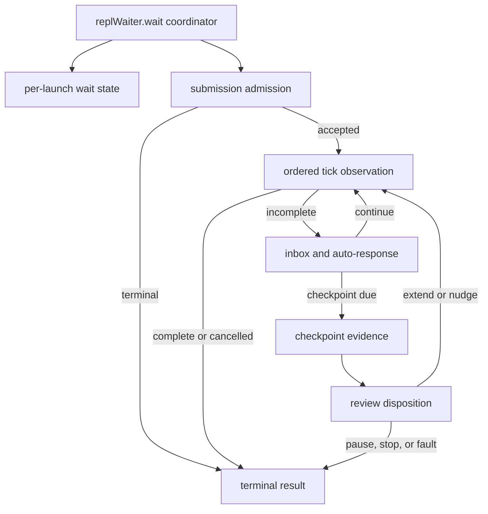

# Tmux wait state-machine refactor plan

**Date:** 2026-09-11
**Branch:** `refactor/tmux-wait-state-machine`
**Base:** merged `main` at `774d4c3c`
**Status:** plan review and characterization passed; extraction pending

## Objective and scope contract

Continue the component-decomposition campaign by reducing the largest remaining
Go workflow function, `replWaiter.wait`, into small package-local components
that preserve the current tmux protocol exactly. The resulting code must be
easier to inspect and debug, keep external I/O at least as efficient as the
current implementation, and have unit, functional, component, race, and
integration evidence appropriate to each boundary.

This campaign changes structure only. It does not change exit codes, timeout
semantics, pane-capture order, persisted interaction records, completion
strategies, policy resolution, provider protocols, or exported APIs. Any defect
found while characterizing the code becomes a separate RED/GREEN batch.

The broader objective remains iterative: after this module merges, rerun the
same Go-native hotspot scan and select the next highest-risk cohesive module.
The current queue begins with Core dispatch, Core review correction, resume
execution, bridge CLI dispatch, and post-review guards. A campaign is not proof
that unrelated modules are already small or fully covered.

## Evidence for selecting this module

A Go AST scan of production files, excluding tests, fixtures, generated code,
and `vendor`, ranked functions by line span and approximate Sonar-style
cognitive complexity.

| Rank | Function | Lines | Approx. cognitive complexity |
|---:|---|---:|---:|
| 1 | `(*replWaiter).wait` | 576 | 110 |
| 2 | `(*cycleRun).dispatch` | 382 | 81 |
| 3 | `(*cycleRun).reviewWithCorrections` | 323 | 77 |
| 4 | `(*resumeExecution).run` | 314 | 75 |
| 5 | `runBridge` | 232 | 75 |
| 6 | `(*cycleRun).applyPostReviewGuards` | 137 | 75 |

All Go commands in this report run from the repository's `go/` module
directory. Baseline commands and results:

```text
go test -count=1 -coverprofile=/tmp/evolve-bridge-baseline.cover ./internal/bridge
PASS; package statement coverage 93.2%

go tool cover -func=/tmp/evolve-bridge-baseline.cover
replWaiter.wait                 97.8%
replWaitResult.recordTokens     50.0%
newReplInboxCursor             100.0%

go test -race -count=1 ./internal/bridge
PASS
```

The waiter has strong behavioral coverage, but it combines configuration,
submission admission, polling, cancellation, live streaming, inbox delivery,
automatic responses, liveness classification, persistent fault gates, review,
nudge delivery, telemetry, and terminal diagnostics in one control flow.

The six uncovered source regions are concrete test targets:

1. retaining an existing token peak when a later pane reports fewer tokens;
2. preserving the default for a negative maximum-extension policy while
   removing the duplicate, unreachable second clamp;
3. reporting an initial baseline-capture failure;
4. reporting a completion-detector error once;
5. the corroborated persistent exhaustion exit;
6. reporting a nudge verification capture failure.

Coverage is a discovery aid, not the test design. Each added test must assert
the observable contract and must fail under a deliberate mutation of that
contract.

## Current responsibilities and proposed boundaries

| Responsibility | Current region | Proposed component |
|---|---:|---|
| Resolve interval, reviewer, completion detector, liveness center, and recovery policy | 77–128 | per-launch state construction |
| Capture the baseline, reject dead-shell spill, and verify initial submission | 166–264 | submission admission |
| Sleep, handle cancellation, poll completion, and capture/stream the permitted pane | 266–346 | coordinator-owned ordered tick sequence, kept visible in one place |
| Drain live injection, emit correlation breadcrumbs, observe idle, and auto-respond | 348–399 | incomplete-tick interaction |
| Recover checkpoint pane, classify liveness, and apply exhaustion/fatal persistence gates | 401–497 | checkpoint evidence and adjudication |
| Notify the reviewer hook, account extensions, and deliver a one-shot nudge | 498–552 | checkpoint disposition |
| Record nudge outcome, timeout diagnostics, final marker, and transient cooldown | 137–150, 555–629 | terminal recording |

One new unexported per-launch state owner will hold only state currently local
to `wait`:

- `replWaitResult`, elapsed counter, interval start, and extension count;
- last `StopEvent` and `ReviewVerdict`;
- completion, detector-error, transient, and nudge flags;
- the nudge event and timestamp;
- completion detector, reviewer, and liveness center;
- checkpoint exhaustion, corroboration, and fatal persistence state.

Ownership already expressed by other objects stays there: `inbox.Cursor` owns
its file offset, `replLiveChannel` owns correlation spans, and `autoResponder`
owns response-loop and transient-dwell state. The extraction adds no package,
dependency, exported name, factory, or new interface.



The event model is intentionally small. The coordinator observes, in order:
cancellation, an ordinary incomplete/completed tick, interaction effects, a
review checkpoint, and terminal disposition. The channel-dependent capture,
stream, and completion-poll sequence remains visible in that coordinator; it
will not be hidden behind a generic tick abstraction. Existing `StopEvent`,
`ReviewVerdict`, completion detectors, and exit constants remain the domain
vocabulary. A package-local step result may carry only `done` and `code` when a
method must distinguish continuation from terminal success or failure.

## Ordering and compatibility invariants

1. Capture the initial baseline exactly once. Dead-shell spill detection runs
   before submission verification and both consume that capture.
2. A post-dispatch regular artifact may override the parked-pane heuristic.
   A stale artifact, missing artifact, or symlink may not.
3. Sleep occurs before the first `elapsed == 0` observation. Keep the logical
   two-second counter; replacing it with wall-clock arithmetic changes behavior.
4. Cancellation performs exactly one detached, grace-bounded final poll for
   artifact, stdout, and Git completion strategies.
5. Channel-on mode captures and streams before completion polling. Channel-off
   mode polls first and performs no auto-response capture after immediate
   completion. Detector-internal captures remain separate.
6. Inbox envelopes drain in file order before auto-response. A correlation
   breadcrumb appears only after confirmed injection.
7. Fast-poll and checkpoint exhaustion/fatal gates keep independent persistence
   state and cadence. Checkpoint persistence is observed at every checkpoint;
   the wall-corroboration latch persists and permits at most one wall probe
   across the wait; fatal evaluation and evidence recording occur once per
   checkpoint.
8. Checkpoint authority remains: capture/recover, liveness observation,
   exhaustion decision, event construction, fatal preemption or review,
   callback, then disposition.
9. The reviewer callback precedes any nudge effect. A nudge is allowed only for
   a deterministic-reviewer pause, an idle pane, and the existing one-shot
   bound.
10. Nudge outcome timing begins after any non-wedged submission verification.
    A missing marker or capture failure (`ResultNotVerified`) continues and is
    accounted exactly as today; only `ResultSubmitWedged` prevents nudge
    accounting. The outcome is recorded exactly once when the outer wait ends.
11. `lastGoodPane` and token peaks update only at the current observation sites;
    extraction must not broaden evidence sampling.
12. Timeout diagnostics retain their order. The structured timeout marker is
    the last stderr diagnostic, and transient cooldown occurs afterward while
    the provider-admission lifetime is still held.

## Strict TDD and characterization protocol

This is a behavior-preserving refactor, so the TDD contract uses the repository
refactor exception: public-seam characterization remains GREEN before and after
extraction. Sensitivity is proved before production moves by applying a
temporary wrong behavior in this isolated worktree and observing the intended
assertion fail; the mutation is removed before the extraction starts. A compile
failure does not count as RED evidence.

### Tests-first batch

Extend existing tables or fixtures rather than creating a parallel harness.
Add only missing behavior:

- a rising-then-falling pane token sequence retains the peak;
- a negative extension limit reports and enforces the default backstop;
- initial capture failure is loud while preserving subsequent disposition;
- repeated detector failure emits one warning;
- persisted and corroborated exhaustion exits through the declared fallback;
- nudge capture failure is loud and preserves bounded submission handling;
- ordinary completion traces for channel-on and channel-off pin capture order
  and prove completion wins over competing wall, fatal, inbox, and
  auto-response effects;
- a cancellation final poll wins over those competing effects in its separate
  path;
- a not-verified nudge continues and records its deferred outcome once;
- fatal preemption proves the reviewer and nudge are not invoked;
- timeout marker placement, transient cooldown, and nudge outcome are each
  exactly once.

For any proposed test, first search existing assertions. Do not duplicate the
already-covered nudge `artifact_appeared`/`no_effect` outcomes, cancellation
strategies, stale-artifact protection, render-wedge handling, or persistence
matrices.

### Executed characterization evidence

Every new test passed against the unchanged implementation and then failed
under the listed temporary assertion-level mutation. Each mutation was restored
before the next contract, and `git diff --exit-code --
go/internal/bridge/driver_tmux_wait.go` confirmed a clean production file at the
end of the batch.

| Contract | Behavior test | Sensitivity mutation and observed failure |
|---|---|---|
| Peak token state survives lower and absent later observations | `TestReplWaitResult_RecordTokensRetainsPeak` | Replaced max accumulation with last-observation assignment; got `0`, wanted `5200` |
| Failed admission capture is loud and records `not_verified` | `TestRunTmuxREPL_InitialSubmitVerificationCaptureFailureIsLoud` | Changed the required diagnostic token; warning count fell from `1` to `0` |
| Repeated completion-detector faults warn once | `TestRunTmuxREPL_CompletionDetectorErrorIsReportedOnce` | Removed the one-shot latch update; warning count rose from `1` to `4` |
| Fast-poll and checkpoint wall corroboration remain independent | `TestTmuxREPL_CheckpointExhaustionCorroboratesIndependently` | Changed the corroborated checkpoint exit from `85` to `81`; exit assertion failed |
| A nudge capture fault remains non-wedged and gets one deferred outcome | `TestOutcome_NudgeCaptureFailureContinuesAndRecordsDeferredResult` | Treated `not_verified` as wedged; the successful run exited `81` and lost its deferred outcome |
| Ordinary completion precedes later tick effects in both channel modes | `TestRunTmuxREPL_OrdinaryCompletionPrecedesTickEffects` | Removed the completion break; channel-off captures changed `0→2` and channel-on `1→2`. Separately moved channel capture after polling; the capture no longer observed the fallback before detector relocation |
| Cancelled final-poll completion precedes ordinary tick effects | `TestRunTmuxREPL_CancelledCompletionPrecedesTickEffects` | Removed the completed-state transition; success changed to exit `81` |
| Cancellation before transient cooldown suppresses the delay | `TestRunTmuxREPL_TransientDwell_CancelBeforeCooldownSkipsDelay` | Removed the context guard; the trace gained a `15s` cooldown |
| Negative maximum-extension policy reports the default | `TestRunTmuxREPL_NegativeMaxExtendsReportsDefault` | Replaced the default backstop with `1`; summary changed from `max_extends=6` to `1` |

After the characterization batch:

- `go test -count=1 -coverprofile=/tmp/evolve-bridge-characterization.cover ./internal/bridge` passed at 93.4% package statement coverage;
- `replWaiter.wait` reached 99.7% and `replWaitResult.recordTokens` reached
  100%; the sole uncovered waiter statement is the unreachable second clamp;
- `go test -race -count=1 ./internal/bridge/...` passed across Bridge and all
  subpackages.

### Extraction loop

For each component:

1. Run its existing and newly characterized public-seam tests.
2. Move one cohesive responsibility without changing assertions or fake pane
   sequences.
3. Run the focused tests, then the complete Bridge package.
4. Inspect coverage for every changed production file. Every extracted
   component and moved control-flow branch must be 100% statement-covered by
   meaningful behavior assertions. Remove truly unreachable branches instead
   of creating artificial tests; selected provider-free integration tests cover
   external-only behavior.
5. Run `go test -race -count=1 ./internal/bridge/...` before the next component.
6. Review the diff for extra captures, sleeps, writes, goroutines, allocations,
   interfaces, and exported names.

No test may be loosened or have fixture frames shifted merely to accommodate a
changed observation order.

## Functional batches

1. **Characterization and contract:** add missing observable tests and record
   mutation failures; production remains unchanged.
2. **State and admission:** introduce the per-launch state owner, reuse
   `replWaitResult.recordTokens`, and extract initial submission admission plus
   terminal outcome recording.
3. **Tick interaction:** keep sleep, cancellation, channel-dependent capture,
   streaming, and completion polling visible in the coordinator; extract only
   a cohesive inbox/auto-response effect if that boundary remains useful after
   characterization.
4. **Checkpoint:** extract liveness evidence, persistent gates, review callback,
   extension accounting, and one-shot nudge.
5. **Coordinator and documentation:** reduce `wait` to readable orchestration,
   rerun metrics, update this report with final topology and evidence, and ship
   only after all reviews pass.

Every batch keeps all existing tests green and uses the repository-native
commit gate plus `evolve ship`. `main` receives only reviewed merge commits.

## Test layers and commands

| Layer | Evidence | Command |
|---|---|---|
| Unit | pure decisions, counters, result/token state, policy defaults | `go test -count=1 ./internal/bridge` with focused `-run` filters during RED/GREEN |
| Functional | `runTmuxREPL`/`Engine.LaunchArgs` against deterministic fake tmux, real temp files, and interaction recorder | `go test -count=1 ./internal/bridge` |
| Component | Bridge driver, completion strategy, responder, inbox, live channel, and fake subprocess/tmux composition | `go test -count=1 ./internal/bridge/...` |
| Concurrency | cursor/channel/recorder and launch isolation | `go test -race -count=1 ./internal/bridge/...` |
| Integration | provider-free real local tmux and fake CLI protocol | `go test -tags=integration -count=1 ./internal/bridge -run '^TestRealTmux_(HappyPath|ArtifactTimeout|NamedSessionResume|ConcurrentSessionsIsolated)$'` |
| Repository | dependency and behavior regression | `go vet ./...` and `go test -count=1 ./...` |

Tests requiring an unavailable local program must report a standard Go skip;
unit and functional tests may not depend on provider access or network calls.

## Performance contract

The wait loop is dominated by tmux, filesystem, and completion-detector I/O.
This structural campaign will not claim CPU speedup without a benchmark. Its
performance gate requires exact equality of external operations on every
characterized path: capture count/order, detector polls, sleeps, sends, file
writes, reviewer calls, and wall probes must remain unchanged. An optimization
that changes those counts needs its own benchmark or failing trace test and
ships separately.

The state owner uses pointer receivers so extracting methods does not repeatedly
copy mutable state. No new goroutine, channel, timer, reflection, generic type,
or dependency is permitted.

## Measurable completion gates

- Report the final `replWaiter.wait` size without forcing a wrapper-driven line
  target. It must keep the capture/poll sequence visible as readable
  orchestration; extracted functions target cognitive complexity 15 or less.
- No changed function remains above complexity 25 without a written,
  architecture-reviewed reason tied to an inseparable invariant.
- Every extracted component and moved control-flow branch reaches 100%
  statement coverage under meaningful behavior assertions; unreachable code is
  removed rather than preserved for artificial coverage.
- Export count, package imports, and package fan-out do not increase.
- Characterized capture/sleep/send/poll/write/reviewer/wall-probe counts and
  observable ordering match baseline exactly.
- Unit, functional, component, race, integration, vet, and repository tests
  pass without weakened assertions.
- Code simplifier, Go code/test reviewer, and architecture reviewer all return
  PASS on the exact staged tree.
- The repository commit gate, GitHub Ubuntu/macOS jobs, validation, and ACS
  durable checks pass before merge.

After merge, the Go-native scan is rerun. The next module is selected from the
remaining critical queue using complexity, churn, dependency reach, coverage,
and architectural cohesion rather than line count alone.

## Review record

The pre-implementation architecture review returned `PROCEED` for the bounded
package-local extraction. After the requested corrections, the architecture,
Go/test, and defensive/minimalism plan reviewers each returned `PASS`. They
rejected a universal event framework and required the ordering invariants
above, one mutable state owner, existing domain types, separate fast/checkpoint
latches, and no broadened evidence sampling. Final simplifier, Go, and
architecture verdicts will be recorded here after the staged implementation
review.
