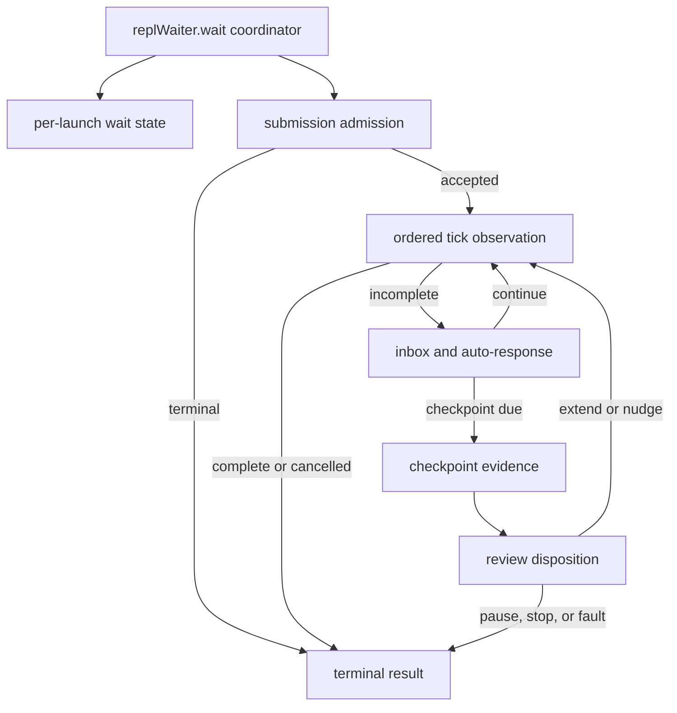

# Tmux wait state-machine refactor plan

**Date:** 2026-09-11
**Campaign branches:** one isolated branch per functional batch
**Campaign base:** merged `main` at `774d4c3c`
**Current batch base:** merged `main` at `59668fec`
**Status:** characterization, state/admission, tick-interaction, and checkpoint
evidence/adjudication batches merged; checkpoint disposition implemented and
locally green; terminal closeout pending

## Objective and scope contract

Continue the component-decomposition campaign by reducing the largest remaining
Go workflow function, `replWaiter.wait`, into small package-local components
that preserve the current tmux protocol exactly. The resulting code must be
easier to inspect and debug, keep external I/O at least as efficient as the
current implementation, and have unit, functional, component, race, and
integration evidence appropriate to each boundary.

This campaign changes structure only. It does not change exit codes, timeout
semantics, pane-capture order, persisted interaction records, completion
strategies, policy resolution, provider protocols, or exported APIs. Any defect
found while characterizing the code becomes a separate RED/GREEN batch.

The broader objective remains iterative: after this module merges, rerun the
same Go-native hotspot scan and select the next highest-risk cohesive module.
The current queue begins with Core dispatch, Core review correction, resume
execution, bridge CLI dispatch, and post-review guards. A campaign is not proof
that unrelated modules are already small or fully covered.

## Evidence for selecting this module

A Go AST scan of production files, excluding tests, fixtures, generated code,
and `vendor`, ranked functions by line span and approximate Sonar-style
cognitive complexity.

| Rank | Function | Lines | Approx. cognitive complexity |
|---:|---|---:|---:|
| 1 | `(*replWaiter).wait` | 576 | 110 |
| 2 | `(*cycleRun).dispatch` | 382 | 81 |
| 3 | `(*cycleRun).reviewWithCorrections` | 323 | 77 |
| 4 | `(*resumeExecution).run` | 314 | 75 |
| 5 | `runBridge` | 232 | 75 |
| 6 | `(*cycleRun).applyPostReviewGuards` | 137 | 75 |

All Go commands in this report run from the repository's `go/` module
directory. Baseline commands and results:

```text
go test -count=1 -coverprofile=/tmp/evolve-bridge-baseline.cover ./internal/bridge
PASS; package statement coverage 93.2%

go tool cover -func=/tmp/evolve-bridge-baseline.cover
replWaiter.wait                 97.8%
replWaitResult.recordTokens     50.0%
newReplInboxCursor             100.0%

go test -race -count=1 ./internal/bridge
PASS
```

The waiter has strong behavioral coverage, but it combines configuration,
submission admission, polling, cancellation, live streaming, inbox delivery,
automatic responses, liveness classification, persistent fault gates, review,
nudge delivery, telemetry, and terminal diagnostics in one control flow.

The six uncovered source regions are concrete test targets:

1. retaining an existing token peak when a later pane reports fewer tokens;
2. preserving the default for a negative maximum-extension policy while
   removing the duplicate, unreachable second clamp;
3. reporting an initial baseline-capture failure;
4. reporting a completion-detector error once;
5. the corroborated persistent exhaustion exit;
6. reporting a nudge verification capture failure.

Coverage is a discovery aid, not the test design. Each added test must assert
the observable contract and must fail under a deliberate mutation of that
contract.

## Current responsibilities and proposed boundaries

| Responsibility | Current region | Proposed component |
|---|---:|---|
| Resolve interval, reviewer, completion detector, liveness center, and recovery policy | 77–128 | per-launch state construction |
| Capture the baseline, reject dead-shell spill, and verify initial submission | 166–264 | submission admission |
| Sleep, handle cancellation, poll completion, and capture/stream the permitted pane | 266–346 | coordinator-owned ordered tick sequence, kept visible in one place |
| Drain live injection, emit correlation breadcrumbs, observe idle, and auto-respond | 348–399 | incomplete-tick interaction |
| Recover checkpoint pane, classify liveness, and apply exhaustion/fatal persistence gates | 401–497 | checkpoint evidence and adjudication |
| Notify the reviewer hook, account extensions, and deliver a one-shot nudge | 498–552 | checkpoint disposition |
| Record nudge outcome, timeout diagnostics, final marker, and transient cooldown | 137–150, 555–629 | terminal recording |

One new unexported per-launch state owner will hold only state currently local
to `wait`:

- `replWaitResult`, elapsed counter, interval start, and extension count;
- last `StopEvent` and `ReviewVerdict`;
- completion, detector-error, transient, and nudge flags;
- the nudge event and timestamp;
- completion detector, reviewer, and liveness center;
- checkpoint exhaustion, corroboration, and fatal persistence state.

Ownership already expressed by other objects stays there: `inbox.Cursor` owns
its file offset, `replLiveChannel` owns correlation spans, and `autoResponder`
owns response-loop and transient-dwell state. The extraction adds no package,
dependency, exported name, factory, or new interface.



The event model is intentionally small. The coordinator observes, in order:
cancellation, an ordinary incomplete/completed tick, interaction effects, a
review checkpoint, and terminal disposition. The channel-dependent capture,
stream, and completion-poll sequence remains visible in that coordinator; it
will not be hidden behind a generic tick abstraction. Existing `StopEvent`,
`ReviewVerdict`, completion detectors, and exit constants remain the domain
vocabulary. A package-local step result may carry only `done` and `code` when a
method must distinguish continuation from terminal success or failure.

## Ordering and compatibility invariants

1. Capture the initial baseline exactly once. Dead-shell spill detection runs
   before submission verification and both consume that capture.
2. A post-dispatch regular artifact may override the parked-pane heuristic.
   A stale artifact, missing artifact, or symlink may not.
3. Sleep occurs before the first `elapsed == 0` observation. Keep the logical
   two-second counter; replacing it with wall-clock arithmetic changes behavior.
4. Cancellation performs exactly one detached, grace-bounded final poll for
   artifact, stdout, and Git completion strategies.
5. Channel-on mode captures and streams before completion polling. Channel-off
   mode polls first and performs no auto-response capture after immediate
   completion. Detector-internal captures remain separate.
6. Inbox envelopes drain in file order before auto-response. A correlation
   breadcrumb appears only after confirmed injection.
7. Fast-poll and checkpoint exhaustion/fatal gates keep independent persistence
   state and cadence. Checkpoint persistence is observed at every checkpoint;
   the wall-corroboration latch persists and permits at most one wall probe
   across the wait; fatal evaluation and evidence recording occur once per
   checkpoint.
8. Checkpoint authority remains: capture/recover, liveness observation,
   exhaustion decision, event construction, fatal preemption or review,
   callback, then disposition.
9. The reviewer callback precedes any nudge effect. A nudge is allowed only for
   a deterministic-reviewer pause, an idle pane, and the existing one-shot
   bound.
10. Nudge outcome timing begins after any non-wedged submission verification.
    A missing marker or capture failure (`ResultNotVerified`) continues and is
    accounted exactly as today; only `ResultSubmitWedged` prevents nudge
    accounting. The outcome is recorded exactly once when the outer wait ends.
11. `lastGoodPane` and token peaks update only at the current observation sites;
    extraction must not broaden evidence sampling.
12. Timeout diagnostics retain their order. The structured timeout marker is
    the last stderr diagnostic, and transient cooldown occurs afterward while
    the provider-admission lifetime is still held.

## Strict TDD and characterization protocol

This is a behavior-preserving refactor, so the TDD contract uses the repository
refactor exception: public-seam characterization remains GREEN before and after
extraction. Sensitivity is proved before production moves by applying a
temporary wrong behavior in this isolated worktree and observing the intended
assertion fail; the mutation is removed before the extraction starts. A compile
failure does not count as RED evidence.

### Tests-first batch

Extend existing tables or fixtures rather than creating a parallel harness.
Add only missing behavior:

- a rising-then-falling pane token sequence retains the peak;
- a negative extension limit reports and enforces the default backstop;
- initial capture failure is loud while preserving subsequent disposition;
- repeated detector failure emits one warning;
- persisted and corroborated exhaustion exits through the declared fallback;
- nudge capture failure is loud and preserves bounded submission handling;
- ordinary completion traces for channel-on and channel-off pin capture order
  and prove completion wins over competing wall, fatal, inbox, and
  auto-response effects;
- a cancellation final poll wins over those competing effects in its separate
  path;
- a not-verified nudge continues and records its deferred outcome once;
- fatal preemption proves the reviewer and nudge are not invoked;
- timeout marker placement, transient cooldown, and nudge outcome are each
  exactly once.

For any proposed test, first search existing assertions. Do not duplicate the
already-covered nudge `artifact_appeared`/`no_effect` outcomes, cancellation
strategies, stale-artifact protection, render-wedge handling, or persistence
matrices.

### Executed characterization evidence

Every new test passed against the unchanged implementation and then failed
under the listed temporary assertion-level mutation. Each mutation was restored
before the next contract, and `git diff --exit-code --
go/internal/bridge/driver_tmux_wait.go` confirmed a clean production file at the
end of the batch.

| Contract | Behavior test | Sensitivity mutation and observed failure |
|---|---|---|
| Peak token state survives lower and absent later observations | `TestReplWaitResult_RecordTokensRetainsPeak` | Replaced max accumulation with last-observation assignment; got `0`, wanted `5200` |
| Failed admission capture is loud and records `not_verified` | `TestRunTmuxREPL_InitialSubmitVerificationCaptureFailureIsLoud` | Changed the required diagnostic token; warning count fell from `1` to `0` |
| Repeated completion-detector faults warn once | `TestRunTmuxREPL_CompletionDetectorErrorIsReportedOnce` | Removed the one-shot latch update; warning count rose from `1` to `4` |
| Fast-poll and checkpoint wall corroboration remain independent | `TestTmuxREPL_CheckpointExhaustionCorroboratesIndependently` | Changed the corroborated checkpoint exit from `85` to `81`; exit assertion failed |
| A nudge capture fault remains non-wedged and gets one deferred outcome | `TestOutcome_NudgeCaptureFailureContinuesAndRecordsDeferredResult` | Treated `not_verified` as wedged; the successful run exited `81` and lost its deferred outcome |
| Ordinary completion precedes later tick effects in both channel modes | `TestRunTmuxREPL_OrdinaryCompletionPrecedesTickEffects` | Removed the completion break; channel-off captures changed `0→2` and channel-on `1→2`. Separately moved channel capture after polling; the capture no longer observed the fallback before detector relocation |
| Inbox input precedes auto-response when both fire on one tick | `TestRunTmuxREPL_InboxPrecedesAutoRespondOnSameTick` | Moved the inbox drain after `tickPane`; the trace placed `AUTO` at send index 4 and operator `F13` at index 5, and the ordering assertion failed |
| Cancelled final-poll completion precedes ordinary tick effects | `TestRunTmuxREPL_CancelledCompletionPrecedesTickEffects` | Removed the completed-state transition; success changed to exit `81` |
| Cancellation before transient cooldown suppresses the delay | `TestRunTmuxREPL_TransientDwell_CancelBeforeCooldownSkipsDelay` | Removed the context guard; the trace gained a `15s` cooldown |
| Negative maximum-extension policy reports the default | `TestRunTmuxREPL_NegativeMaxExtendsReportsDefault` | Replaced the default backstop with `1`; summary changed from `max_extends=6` to `1` |

After the characterization batch:

- `go test -count=1 -coverprofile=/tmp/evolve-bridge-characterization.cover ./internal/bridge` passed at 93.4% package statement coverage;
- `replWaiter.wait` reached 99.7% and `replWaitResult.recordTokens` reached
  100%; the sole uncovered waiter statement is the unreachable second clamp;
- `go test -race -count=1 ./internal/bridge/...` passed across Bridge and all
  subpackages.

### Extraction loop

For each component:

1. Run its existing and newly characterized public-seam tests.
2. Move one cohesive responsibility without changing assertions or fake pane
   sequences.
3. Run the focused tests, then the complete Bridge package.
4. Inspect coverage for every changed production file. Every extracted
   component and moved control-flow branch must be 100% statement-covered by
   meaningful behavior assertions. Remove truly unreachable branches instead
   of creating artificial tests; selected provider-free integration tests cover
   external-only behavior.
5. Run `go test -race -count=1 ./internal/bridge/...` before the next component.
6. Review the diff for extra captures, sleeps, writes, goroutines, allocations,
   interfaces, and exported names.

No test may be loosened or have fixture frames shifted merely to accommodate a
changed observation order.

## Functional batches

1. **Characterization and contract:** add missing observable tests and record
   mutation failures; production remains unchanged.
2. **State and admission:** introduce the per-launch state owner, reuse
   `replWaitResult.recordTokens`, and extract initial submission admission plus
   terminal outcome recording.
3. **Tick interaction:** keep sleep, cancellation, channel-dependent capture,
   streaming, and completion polling visible in the coordinator; extract only
   a cohesive inbox/auto-response effect if that boundary remains useful after
   characterization.
4. **Checkpoint evidence/adjudication:** retain pane evidence, update liveness
   and persistent fault gates, build one `StopEvent`, select one verdict, and
   publish the review callback.
5. **Checkpoint disposition:** apply extension accounting and the bounded
   one-shot nudge as a separate transaction after adjudication.
6. **Terminal closeout:** isolate timeout diagnostics, escalation evidence,
   transient classification, final marker emission, and bounded cooldown while
   preserving their exact order.
7. **Coordinator and documentation:** reduce `wait` to readable orchestration,
   rerun metrics, update this report with final topology and evidence, and ship
   only after all reviews pass.

Every batch keeps all existing tests green and uses the repository-native
commit gate plus `evolve ship`. `main` receives only reviewed merge commits.

## State and admission implementation record

The first production batch was implemented as two independently reviewed
function slices after the characterization commit:

| Commit | Component | Result |
|---|---|---|
| `14c87602` | Characterization contract and this plan | Nine mutation-sensitive contracts; production unchanged |
| `93aa511f` | Per-launch state construction and terminal nudge outcome | One state owner for policy, detectors, gates, progress, and result; duplicate extension clamp removed |
| `e2e7b4da` | Prompt admission and timeout-marker formatting | One baseline capture shared by telemetry, dead-shell detection, and submission verification |

The implemented files have narrow roles:

- `driver_tmux_wait_state.go` owns the mutable state for one launch, resolves
  defaults once, constructs the completion and liveness strategies, retains
  checkpoint-only persistence gates, records peak tokens and the deferred nudge
  outcome, and formats the structured timeout marker from a single snapshot.
- `driver_tmux_wait_admission.go` captures one post-dispatch pane, reports a
  failed capture, rejects a confirmed dead-shell spill before sending any more
  input, records submission verification, and allows a new regular non-symlink
  artifact to override a parked-pane heuristic without bypassing the completion
  detector's later stability window.
- `driver_tmux_wait.go` remains the coordinator. Its ordered sleep,
  cancellation, channel capture/stream, detector poll, inbox, auto-response,
  checkpoint, and timeout effects stay visible and in their original order.

Two unreachable branches were deleted instead of preserved with artificial
conditions. `defaultIfZero` already maps a non-positive extension limit to the
positive default, so the second clamp could never execute. `runTmuxREPL`
returns from boot-only launches before prompt dispatch and before constructing
`replWaiter`, so admission no longer wraps verification in a second boot-only
condition. No constant-false expression, exported API, interface, dependency,
goroutine, timer, capture, poll, sleep, send, write, or wall probe was added.

After this batch, `replWaiter.wait` is 380 lines, down from 576. This is an
intermediate structural measure: the remaining size is the intentionally
visible tick order plus the still-inline interaction, checkpoint, and terminal
responsibilities. The batch does not claim the full waiter decomposition is
finished.

Verification on the exact production slices:

```text
go test -count=1 -coverprofile=/tmp/evolve-tmux-admission-final.cover ./internal/bridge
PASS; test summary 93.3% (the cover profile total rounds to 93.4%)

go tool cover -func=/tmp/evolve-tmux-admission-final.cover
replWaiter.wait                         100.0%
replWaiter.admitPrompt                  100.0%
newReplWaitState                        100.0%
replWaitResult.recordTokens             100.0%
replWaitState.recordNudgeOutcome        100.0%
replWaitState.writeArtifactTimeoutMarker 100.0%

go test -count=1 ./internal/bridge/...
PASS

go test -race -count=1 ./internal/bridge/...
PASS

go vet ./internal/bridge/...
PASS

golangci-lint run ./internal/bridge/...
PASS; 0 issues

go test -tags=integration -count=1 ./internal/bridge \
  -run '^TestRealTmux_(HappyPath|ArtifactTimeout|NamedSessionResume|ConcurrentSessionsIsolated)$'
PASS

go test -count=1 ./...
PASS

go vet ./...
PASS
```

Architecture, Go, and simplification/defensive reviewers returned PASS on the
exact staged state tree `d1b2bab025c5377a63a1a66e76924d9b783b2a4c` and the
exact staged admission tree `bf7fb7a476d2c70387a2fa46d1d0e38ae380639e`. The
native commit gate attested each tree before `evolve ship` committed it.

## Tick-interaction implementation record

The second production batch starts from merged main `c72f68b2` on the isolated
`refactor/tmux-wait-tick-interaction` branch. It extracts exactly one cohesive
effect boundary into `driver_tmux_wait_interaction.go`:

- drain operator envelopes in file order;
- emit a correlation breadcrumb only after `injectEnvelope` confirms delivery;
- close a delivered injection's busy-to-idle span;
- apply the already-resolved auto-response outcome;
- refresh the review interval, form the transient-dwell stop evidence, or map
  the two existing auto-response terminal codes.

The method returns the package-local `replWaitStep`, whose only fields are
`done` and `code`. A transient dwell ends the polling loop with `ExitOK` in the
step so the existing timeout diagnostics and cooldown still run. Escalation and
loop-guard outcomes retain their immediate returns. No generic event framework
or new interface was introduced.

`replWaiter.wait` retains the ordering that must remain reviewable in one place:
sleep, cancellation and detached final poll, channel-dependent capture and
stream, ordinary completion poll, channel-off capture, interaction call, and
checkpoint eligibility. The extraction adds no capture, detector poll, sleep,
send, write, wall probe, goroutine, channel, timer, dependency, or exported
name. Its characterization uses the public `runTmuxREPL` seam and proves the
operator inbox effect wins over a competing auto-response on the same tick.

After extraction, `replWaiter.wait` spans 332 lines, down from 380 after the
state/admission batch and 576 before the campaign. The new
`handleTickInteractions` method is 56 executable/comment lines in a 75-line
single-purpose file. Both functions reach 100% statement coverage in the full
Bridge package suite; package coverage remains 93.3% in the test summary and
93.4% in the cover profile total.

The tests-first evidence was:

```text
go test -count=1 ./internal/bridge \
  -run '^TestRunTmuxREPL_InboxPrecedesAutoRespondOnSameTick$'
PASS on the unchanged implementation

temporary mutation: move inbox drain after auto-response
FAIL: inbox=5 auto=4; sent=[... AUTO|false F13|false AUTO|false]

restore mutation and apply extraction
PASS

go test -count=1 -coverprofile=/tmp/evolve-tmux-tick.cover ./internal/bridge
PASS; test summary 93.3%, cover profile total 93.4%
replWaiter.wait              100.0%
replWaiter.handleTickInteractions 100.0%

go test -count=1 ./internal/bridge/...
PASS

go test -race -count=1 ./internal/bridge/...
PASS

go vet ./internal/bridge/...
PASS

golangci-lint run ./internal/bridge/...
PASS; 0 issues

go test -tags=integration -count=1 ./internal/bridge \
  -run '^TestRealTmux_(HappyPath|ArtifactTimeout|NamedSessionResume|ConcurrentSessionsIsolated)$'
PASS

go test -count=1 ./...
PASS

go vet ./...
PASS
```

## Checkpoint evidence/adjudication implementation record

The third production batch starts from merged main `e7f1460c` on the isolated
`refactor/tmux-wait-checkpoint-evidence` branch. It adds
`driver_tmux_wait_checkpoint.go` with one package-local method,
`reviewCheckpoint`, and a two-value package-local result type. The normal
result means a verdict has been published; the failover result means the
coordinator must return the existing `ExitUnknownPrompt` code. No success exit
code is overloaded to mean "close the timeout loop."

The extracted method owns one transaction:

1. update peak tokens and retain the last non-empty pane;
2. observe liveness through `SignalCenter`;
3. evaluate the checkpoint-only exhaustion gate and its one-probe
   corroboration latch;
4. derive changed/busy/render-wedge evidence and construct one `StopEvent`;
5. call the checkpoint fatal gate exactly once, falling through to the
   configured reviewer only when it does not preempt;
6. save and log one verdict, then invoke the nil-safe review callback.

At that batch boundary, the coordinator continued to own checkpoint
eligibility, the one fresh pane capture, blank-pane recovery, failover return,
and all verdict disposition. That boundary kept polling and loop control
visible while making evidence and adjudication independently callable in a
unit test. It also preserved the load-bearing order: recover pane,
retain/classify evidence, exhaustion exit or fatal/reviewer selection, durable
fatal outcome, verdict log, callback, then disposition.

The existing S4 anti-bypass guard now reads both
`driver_tmux_wait.go` and `driver_tmux_wait_checkpoint.go`. A future direct
`PaneBusy` or `PaneHasSubstantiveChange` call cannot evade the guard merely by
moving across the extraction seam. Stale source-line references were removed
from that test and from the timeout diagnostic comment.

Strict TDD used two complementary contracts:

```text
Engine.LaunchArgs composition characterization
TestRunTmuxREPL_PersistentFatalCheckpointPreservesTheWholeDecisionChain
PASS on unchanged production

temporary mutation: ignore fatal preemption and always call the reviewer
FAIL: reviewer calls = 2, want 1 before the fatal gate crosses

restore production and verify driver_tmux_wait.go has no diff
PASS

direct component contract written before the method existed
TestReviewCheckpoint_BuildsAndPublishesEvidence
COMPILE-RED: replWaiter.reviewCheckpoint and checkpointReviewed undefined

extract the minimum checkpoint evidence/adjudication method
PASS
```

The composition contract drives the public `Engine.LaunchArgs` entrypoint with
two consecutive fatal panes at enforcement stage. It proves the first
observation reaches the reviewer, the gate-crossing observation bypasses it,
the callbacks are `extend` then `stop`, the durable C2 `fast_failed` record and
stop log exist before the stop callback, no nudge is sent or recorded, and the
ordinary exit-81 timeout marker retains `last_review=stop` plus the typed
`model_invalid` reason. The direct contract proves a standalone checkpoint
builds its event identity, timing, pane tail, injected prompt, retained pane,
verdict, and callback.

After extraction, `replWaiter.wait` spans 237 lines, down from 332 after the
tick-interaction batch, 380 after state/admission, and 576 before the campaign.
`reviewCheckpoint` spans 74 lines in a 96-line single-purpose file. Both reach
100% statement coverage in the Bridge suite. This batch adds no capture,
completion poll, sleep, send, file write, wall probe, goroutine, channel,
timer, dependency, interface, exported name, or constant-false condition.

Validation before review:

```text
go test -count=1 -coverprofile=/tmp/evolve-tmux-checkpoint.cover ./internal/bridge/...
PASS; Bridge package 93.4% statement coverage
replWaiter.wait              100.0%
replWaiter.reviewCheckpoint  100.0%

go test -race -count=1 ./internal/bridge/...
PASS

go vet ./internal/bridge/...
PASS

golangci-lint run ./internal/bridge/...
PASS; 0 issues

go test -tags=integration -count=1 ./internal/bridge \
  -run '^TestRealTmux_(HappyPath|ArtifactTimeout|NamedSessionResume|ConcurrentSessionsIsolated)$'
PASS

go test -count=1 ./...
PASS

go vet ./...
PASS
```

## Checkpoint disposition implementation record

The fourth production batch starts from merged main `59668fec` on the isolated
`refactor/tmux-wait-checkpoint-disposition` branch. It adds
`driver_tmux_wait_disposition.go` with two package-local methods and an explicit
two-value result type. `checkpointContinueWaiting` starts another interval;
`checkpointStopWaiting` ends the completion wait and is deliberately the zero
value so an unknown action cannot accidentally extend a session.

`applyCheckpointDisposition` owns verdict translation and interval accounting:

1. `ReviewExtend` increments the attempt and moves the interval origin;
2. `ReviewStop` and unknown actions stop immediately;
3. `ReviewPause` may nudge only when the reviewer is the existing deterministic
   value or pointer type, `SignalCenter.Busy(session)` is false, and the
   one-shot nudge has not already been sent;
4. every ineligible pause stops without pane I/O.

`deliverArtifactNudge` owns the one cohesive I/O transaction: send the existing
message, announce it, wait for the existing settle duration, capture once,
verify bounded submission, record the verification, classify a wedged submit,
and otherwise retain the deferred nudge outcome before starting one final
interval. The coordinator now performs capture/recovery, calls
`reviewCheckpoint`, handles failover, and applies this disposition in that
order. The review callback remains inside `reviewCheckpoint`, so it is
structurally published before any disposition effect.

Strict TDD used both the public composition and direct component seams:

```text
Engine.LaunchArgs composition characterization
TestRunTmuxREPL_StopReviewCallbackPrecedesNudge
PASS on unchanged production

temporary mutation: move the pause callback after the nudge SendKeys call
FAIL: artifact nudge was sent before the pause review callback

restore production and verify both production files have no diff
PASS

direct component contracts written before the method existed
TestApplyCheckpointDisposition_ExtendAdvancesInterval
TestApplyCheckpointDisposition_StopEndsWait
COMPILE-RED: applyCheckpointDisposition and result constants undefined

extract disposition and nudge delivery, then compose after reviewCheckpoint
PASS

review-strengthening contracts
TestApplyCheckpointDisposition_StopActionsDoNotNudge
temporary mutation: remove the ReviewPause action guard
FAIL: stop, empty, and unknown actions returned continue and sent a nudge

TestApplyCheckpointDisposition_IdlePauseNudgesAndAdvancesOneInterval
temporary mutation: remove the successful nudge attempt increment
FAIL: attempt 2, want 3

TestApplyCheckpointDisposition_WedgedNudgeDoesNotAdvanceInterval
temporary mutation: account the interval before checking the wedged result
FAIL: wedged nudge changed attempt 2→3 and interval start 4→10

restore each mutation and run all disposition contracts with -race -count=20
PASS
```

The S4 anti-bypass guard now reads the coordinator, adjudication module, and
disposition module. Moving a direct chrome parser into the new file therefore
cannot evade the existing `PaneBusy` and `PaneHasSubstantiveChange` prohibition.
Existing integration contracts continue to prove exactly one nudge, a nudge
buying one interval, submit verification and bounded Enter resend, deferred
outcome recording, wedged-nudge cause retention, custom-reviewer pause without
a nudge, busy deterministic review without a nudge, and fatal-stop preemption.

After extraction, `replWaiter.wait` spans 191 lines, down from 237 after the
checkpoint batch, 332 after tick interaction, 380 after state/admission, and
576 before the campaign. `applyCheckpointDisposition` spans 19 lines and
`deliverArtifactNudge` spans 30 lines in a 74-line single-purpose file. All
three functions reach 100% statement coverage in the Bridge suite. This batch
adds no capture, completion poll, sleep, send, file write, goroutine, channel,
timer, dependency, interface, exported name, or constant-false condition.

Validation before review:

```text
go test -count=1 -coverprofile=/tmp/evolve-bridge-disposition.cover ./internal/bridge
PASS; Bridge package 93.4% statement coverage
replWaiter.wait                         100.0%
replWaiter.applyCheckpointDisposition  100.0%
replWaiter.deliverArtifactNudge         100.0%

go test -race -count=1 ./internal/bridge/...
PASS

go vet ./internal/bridge/...
PASS

golangci-lint run ./internal/bridge/...
PASS; 0 issues

go test -tags=integration -count=1 ./internal/bridge \
  -run '^TestRealTmux_(HappyPath|ArtifactTimeout|NamedSessionResume|ConcurrentSessionsIsolated)$'
PASS

go test -count=1 ./...
PASS

go vet ./...
PASS
```

## Test layers and commands

| Layer | Evidence | Command |
|---|---|---|
| Unit | pure decisions, counters, result/token state, policy defaults | `go test -count=1 ./internal/bridge` with focused `-run` filters during RED/GREEN |
| Functional | `runTmuxREPL`/`Engine.LaunchArgs` against deterministic fake tmux, real temp files, and interaction recorder | `go test -count=1 ./internal/bridge` |
| Component | Bridge driver, completion strategy, responder, inbox, live channel, and fake subprocess/tmux composition | `go test -count=1 ./internal/bridge/...` |
| Concurrency | cursor/channel/recorder and launch isolation | `go test -race -count=1 ./internal/bridge/...` |
| Integration | provider-free real local tmux and fake CLI protocol | `go test -tags=integration -count=1 ./internal/bridge -run '^TestRealTmux_(HappyPath|ArtifactTimeout|NamedSessionResume|ConcurrentSessionsIsolated)$'` |
| Repository | dependency and behavior regression | `go vet ./...` and `go test -count=1 ./...` |

Tests requiring an unavailable local program must report a standard Go skip;
unit and functional tests may not depend on provider access or network calls.

## Performance contract

The wait loop is dominated by tmux, filesystem, and completion-detector I/O.
This structural campaign will not claim CPU speedup without a benchmark. Its
performance gate requires exact equality of external operations on every
characterized path: capture count/order, detector polls, sleeps, sends, file
writes, reviewer calls, and wall probes must remain unchanged. An optimization
that changes those counts needs its own benchmark or failing trace test and
ships separately.

The state owner uses pointer receivers so extracting methods does not repeatedly
copy mutable state. No new goroutine, channel, timer, reflection, generic type,
or dependency is permitted.

## Measurable completion gates

- Report the final `replWaiter.wait` size without forcing a wrapper-driven line
  target. It must keep the capture/poll sequence visible as readable
  orchestration; extracted functions target cognitive complexity 15 or less.
- No changed function remains above complexity 25 without a written,
  architecture-reviewed reason tied to an inseparable invariant.
- Every extracted component and moved control-flow branch reaches 100%
  statement coverage under meaningful behavior assertions; unreachable code is
  removed rather than preserved for artificial coverage.
- Export count, package imports, and package fan-out do not increase.
- Characterized capture/sleep/send/poll/write/reviewer/wall-probe counts and
  observable ordering match baseline exactly.
- Unit, functional, component, race, integration, vet, and repository tests
  pass without weakened assertions.
- Code simplifier, Go code/test reviewer, and architecture reviewer all return
  PASS on the exact staged tree.
- The repository commit gate, GitHub Ubuntu/macOS jobs, validation, and ACS
  durable checks pass before merge.

After merge, the Go-native scan is rerun. The next module is selected from the
remaining critical queue using complexity, churn, dependency reach, coverage,
and architectural cohesion rather than line count alone.

## Review record

The pre-implementation architecture review returned `PROCEED` for the bounded
package-local extraction. After the requested corrections, the architecture,
Go/test, and defensive/minimalism plan reviewers each returned `PASS`. They
rejected a universal event framework and required the ordering invariants
above, one mutable state owner, existing domain types, separate fast/checkpoint
latches, and no broadened evidence sampling.

For the tick-interaction batch, the code simplifier/defensive reviewer, Go
code/test reviewer, and architecture reviewer returned PASS with no findings
on staged tree `a6be7d74175432e7fb96002b59a98d6118292196`. They confirmed
that the boundary is cohesive, the same-tick test is mutation-sensitive, the
immediate exits and common timeout closeout remain distinct, and ordered pane
observation stays visible in the coordinator. The final documentation-only
review-record update was applied after those verdicts and is included in the
commit-gate tree.

For the checkpoint evidence/adjudication batch, the same three reviewers
returned PASS with no findings on staged tree
`7143171d6c705bcd91f8a7d20fe8923aaeb84965`. They confirmed that capture and
recovery remain visible in the coordinator, gate state remains per launch,
exhaustion still precedes event/review work, fatal preemption still records and
logs before callback publication, the typed two-result boundary does not
overload a success exit code, the public composition contract is
mutation-sensitive, and the S4 source guard covers both sides of the extraction
seam. The only later change is this factual review record; all reviewers must
confirm the final staged tree before attestation.

For the checkpoint disposition batch, the first review caught three evidence
defects before ship: inaccurate function lengths, a stop-action fixture that
was not otherwise eligible to nudge, and missing direct assertions for the
successful versus wedged nudge interval accounting. The tests and report were
corrected, and temporary mutations proved each new assertion fails for the
intended regression. The architecture reviewer, Go code/test reviewer, and
defensive code-simplifier then returned PASS with no findings on staged tree
`987c1652ebfedb19df9bd8655538c4bb39b46172`. They confirmed the 191/19/30-line
metrics, callback-before-effect ordering, SignalCenter authority, I/O order,
per-launch state ownership, unknown-action rejection, and opposite successful
and wedged accounting outcomes. This factual review record is the only later
change; all three reviewers must reconfirm the final staged tree before
attestation.
